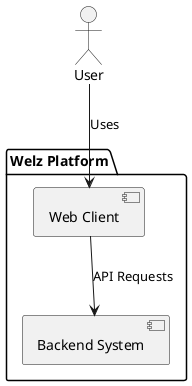
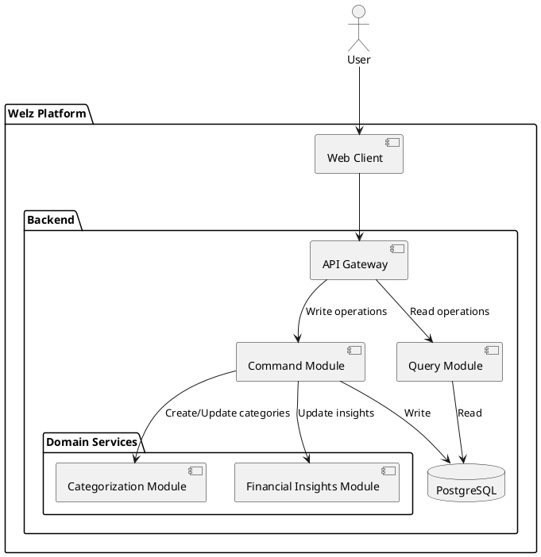
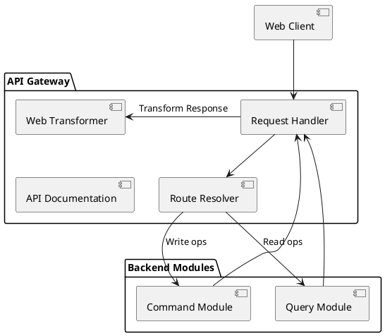
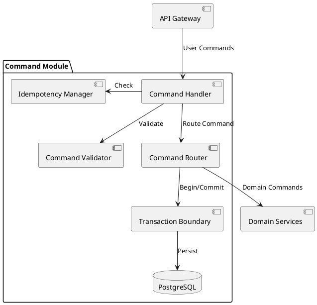
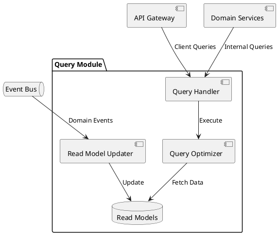
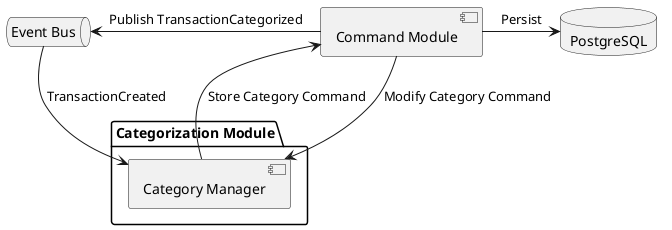
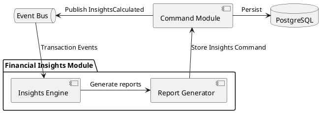

# Architecture

## Table of Contents
- [Technical Stack](#technical-stack)
  - [Frontend](#frontend)
  - [Backend](#backend)
- [Architecture Patterns](#architecture-patterns)
  - [Domain-Driven Design (DDD)](#domain-driven-design-ddd)
  - [CQRS Implementation](#cqrs-implementation)
  - [SOLID Principles](#solid-principles)
  - [DRY (Don't Repeat Yourself)](#dry-dont-repeat-yourself)
  - [Clean Code Principles](#clean-code-principles)
- [High-Level Design](#high-level-design)
  - [System Overview](#system-overview)
  - [Core Components & Interactions](#core-components--interactions)
- [Infrastructure](#infrastructure)
- [Deployment Model](#deployment-model)
- [Security Considerations](#security-considerations)
- [C4 diagrams](#c4-diagrams)
  - [Context Diagram](#context-diagram)
  - [Container Diagram](#container-diagram)
- [Component Diagrams](#component-diagrams)
  - [API Gateway Module](#api-gateway-module)
  - [Command Module](#command-module)
  - [Query Module](#query-module)
  - [Categorization Module](#categorization-module)
  - [Financial Insights Module](#financial-insights-module)
- [Project Structure](#project-structure)
- [Installation Guide](#installation-guide)

## Technical Stack

### Frontend
- **Web Client**: 
  - Framework: Deno Fresh (Islands Architecture)
  - Language: TypeScript
  - State Management: Effect TS
  - UI Components: Preact with Tailwind CSS

### Backend
- **Runtime**: Deno
- **Framework**: Fresh for backend APIs
- **Core Libraries**: 
  - Effect TS for functional programming and error handling
  - Preact for UI components
  - Tailwind for styling
- **Database**: 
  - PostgreSQL with Effect TS query builders
  - Nessie for database migrations

## Architecture Patterns

### Domain-Driven Design (DDD)

#### Strategic Design
- **Bounded Contexts**:
  - Financial Accounts
  - Transactions & Categorization
  - Analytics & Insights

#### Tactical Design
- **Aggregates**:
  - Account (root) → Transactions
  - Category (root) → Transaction Categories
  
- **Value Objects**:
  - Money (amount + currency)
  - DateRange
  - TransactionMetadata

- **Domain Events**:
  - TransactionCreated
  - TransactionCategorized
  - AccountBalanceUpdated
  - CategoryInsightsCalculated

- **Repositories**:
  - AccountRepository
  - TransactionRepository
  - CategoryRepository

### CQRS Implementation
The system implements a simplified CQRS pattern to achieve:

- Clear separation between write and read operations
- Commands store in normalized tables
- Queries use materialized views
- Strong consistency model through PostgreSQL
- Simple in-memory event bus for module communication

#### Event Bus Implementation
- In-memory pub/sub pattern using Effect TS
- Simple topic-based subscription model
- Synchronous event processing
- No event persistence (events are ephemeral)
- Module-to-module communication only

#### Command Handling
- Commands represent user intentions
- Validation before execution
- Direct persistence to PostgreSQL
- Success/failure responses

#### Query Handling
- Materialized views for optimized reading
- Views are refreshed on relevant domain events
- Built-in PostgreSQL query optimization
- No direct table access from query side

### SOLID Principles

#### Single Responsibility Principle (SRP)
- Each module has one reason to change
- Clear separation between command and query responsibilities
- Dedicated services for specific domain operations

#### Open/Closed Principle (OCP)
- Extensible command/query handlers
- Plugin-based provider architecture for financial institutions
- Category rules system supports custom rules

#### Liskov Substitution Principle (LSP)
- Abstract financial provider interfaces
- Interchangeable storage implementations

#### Interface Segregation Principle (ISP)
- Specific command/query interfaces
- Targeted repository interfaces
- Granular service contracts

#### Dependency Inversion Principle (DIP)
- Core domain logic depends on abstractions
- Infrastructure implementations injected at runtime
- Effect TS for functional dependencies

### DRY (Don't Repeat Yourself)

#### Code Reuse Strategy
- Shared domain models across bounded contexts
- Common validation rules
- Reusable UI components
- Shared test utilities

#### Infrastructure Patterns
- Generic repository implementations
- Common error handling
- Unified logging approach
- Shared authentication middleware

### Clean Code Principles

#### Naming Conventions
- **Intention-Revealing Names**
  - Commands: `CreateTransactionCommand`, `UpdateBudgetCommand`
  - Queries: `GetTransactionsByDateQuery`, `GetNetWorthQuery`
  - Services: `TransactionNormalizationService`, `CategoryPredictionService`

#### Function Design
- **Small and Focused**
  - Each function does one thing
  - Maximum 20 lines per function
  - Clear input/output contracts
  - Early returns for validation

#### Code Organization
- **Consistent File Structure**
  - Separate commands and queries
  - Group related domain logic
  - Consistent module organization
  - Clear dependency hierarchy

#### Error Handling
- **Functional Error Management**
  - Effect TS for error handling
  - Clear error hierarchies
  - Meaningful error messages
  - Proper error logging

#### Testing Approach
- **Test-First Development**
  - Unit tests for business logic
  - Integration tests for workflows
  - E2E tests for critical paths
  - Clear test naming and structure

#### Comments and Documentation
- **Self-Documenting Code**
  - Clear function and variable names
  - Documented public APIs
  - Architecture decision records
  - Essential business logic comments

## High-Level Design

### System Overview
The **Welz** platform consists of:
1. **Frontend Application** – A web-based client using Fresh/Preact
2. **Backend System** – A monolithic service handling data management, categorization, and basic insights

### Core Components & Interactions

#### Frontend Application
- **Web Client**: Responsive web application built with Fresh

#### Backend Core Components
- **API Gateway**: Entry point for all client requests
- **Command Module**: Handles write operations
- **Query Module**: Handles read operations
- **Categorization Module**: Basic transaction categorization
- **Financial Insights Module**: Basic spending analytics
- **Database**: PostgreSQL for data storage

## Infrastructure

The infrastructure is designed to support both local development and future cloud deployment:

### CI/CD Pipeline
- **GitHub Actions** for continuous integration:
  - Runs tests (unit, integration)
  - Checks code formatting
  - Builds Docker images
  - Runs security scans

### Development Environment
- **Docker Compose** setup with PostgreSQL container

### Monitoring & Logging
- Basic logging with correlation IDs
- Error tracking

## Deployment Model

### Local Development
1. **Docker Compose** setup for local development
   ```yaml
   services:
     app:
       build: .
       ports:
         - "8000:8000"
       volumes:
         - .:/app
     db:
       image: postgres:latest
   ```

2. **Development Workflow**
   - Hot reload enabled for frontend and backend
   - Watch mode for tests
   - Local environment variables
   - Database migrations run automatically

### Production Deployment
1. **Containerization**
   - Single Docker image for backend
   - Environment-specific configurations
   - Production optimized builds

2. **Initial Infrastructure**
   - Single web server deployment
   - PostgreSQL database

## Security Considerations

### Data Protection
- **Encryption**
  - Data at rest encryption for databases
  - TLS 1.3 for all communications

### Authentication & Authorization
- **Session Management**
  - Basic session handling
  - Simple JWT tokens

### Audit & Compliance
- **Logging**
  - Security event logging
  - Access logs

### Financial Data Security
- **PSD2 Requirements**
  - Basic authentication
  - HTTPS encryption

## C4 diagrams

### Context Diagram


### Container Diagram


**API Gateway**
- Single entry point for all API requests
- Handles request routing, validation, and authentication
- Manages API versioning and documentation
- Implements rate limiting and request throttling
- Routes requests to Command or Query modules based on operation type

**Command Module**
- Processes write commands from external and internal sources
- Enforce domain rules and maintain data consistency
- Directly persists changes to PostgreSQL
- Handle idempotency and retries

**Query Module**
- Handles all read operations
- Implements caching strategies
- Uses read replicas for better performance
- Subscribes to relevant events to invalidate caches

**Categorization Module**
- Automatically categorizes transactions based on past behavior
- Allows users to change transaction categories providing reinforcement to categorization accuracy
- Stores categorized transactions in the Database

**Financial Insights Module**
- Computes real-time net worth based on assets and liabilities
- Generates financial reports
- Stores financial metrics in the Database

**Database**
- PostgreSQL for relational data storage
- Ensures efficient and structured data access

## Component Diagrams

### API Gateway Module

The API Gateway Module serves as the unified entry point for all external requests, with client-specific response transformation for web and mobile clients.

#### Core Responsibilities:
- Process all incoming requests
- Route requests to Command or Query modules
- Provide unified error handling and logging
- Monitor API health and metrics

#### Component Diagram:


#### **Component Details:**

**Request Handler**
- Unified entry point for all HTTP requests
- Client type detection and routing
- Request lifecycle management
- Circuit breaking for downstream services
- Response transformer selection

**Route Resolver**
- Command/Query operation routing
- Unified timeout policies
- Core business logic routing

**Web Transformer**
- Web-specific response formats
- Desktop browser optimizations
- Web-specific caching strategies

**API Documentation**  
- Complete OpenAPI endpoint documentation
- Request/response schemas
- Example payloads
- Error responses
- Interactive Swagger UI for testing

### Command Module

The Command Module handles all write operations in the system, serving as the single entry point for both API and internal commands from domain modules.

#### **Core Responsibilities:**
- Process write commands from external and internal sources
- Enforce domain rules and maintain data consistency
- Persist changes to PostgreSQL
- Handle idempotency and retries

#### **Component Diagram:**


#### Component Details:

**Command Handler**
- Processes incoming commands
- Orchestrates validation and execution
- Returns command results
- Handles errors and rollbacks

**Command Validator**
- Validates command structure and data
- Checks business rules and constraints
- Validates aggregate state transitions
- Enforces authorization rules
- Returns early on validation failures

**Command Router**
- Routes commands to domain services
- Handles service errors
- Manages command timeouts

**Transaction Boundary**
- Manages database transactions
- Handles rollbacks
- Maintains data consistency

### Query Module

The Query Module handles all read operations, managing optimized read models and caching strategies for different client needs.

#### Core Responsibilities:
- Process read queries
- Maintain optimized read models
- Transform query results
- Subscribe to relevant events

#### Component Diagram:


#### Component Details:

**Query Handler**
- Routes queries to appropriate handlers
- Manages response transformation
- Handles pagination requests

**Read Model Updater**
- Subscribes to domain events
- Updates read models by refreshing materialized views
- Maintains model consistency

**Query Optimizer**
- Basic query execution plans
- Implements pagination
- Handles basic sorting and filtering

### Categorization Module

The Categorization Module provides transaction categorization.

#### Core Responsibilities:
- Basic transaction categorization
- Handle user category updates
- Process categorization business logic

#### Component Diagram:


#### **Component Details:**

**Category Manager**
- Orchestrates categorization workflow
- Manages category hierarchy
- Handles user overrides
- Coordinates prediction requests
- Publishes categorization events

### Financial Insights Module

The Financial Insights Module processes financial data to provide real-time insights and reports.

#### Core Responsibilities:
- Calculate basic net worth
- Generate category breakdowns
- Track monthly trends

#### Component Diagram:


#### Component Details:

**Insights Engine**
- Receives domain events (transactions, categories)
- Performs financial calculations
- Creates analytics commands for persistence

**Report Generator**
- Handles report requests
- Uses Query Module to access pre-calculated data
- Formats data for presentation

## Project Structure

```
/
├── apps/                       # Application code
│   ├── backend/               # Backend monolith
│   │   ├── src/
│   │   │   ├── domain/       # Domain model and aggregates
│   │   │   │   ├── account/  # Account aggregate
│   │   │   │   ├── transaction/ # Transaction aggregate
│   │   │   │   └── category/ # Category aggregate
│   │   │   ├── application/  # Application services
│   │   │   │   ├── commands/ # Command handlers
│   │   │   │   ├── queries/  # Query handlers
│   │   │   │   └── events/   # Event handlers
│   │   │   ├── infrastructure/ # Technical implementations
│   │   │   │   ├── db/      # Database access
│   │   │   │   └── eventbus/ # In-memory event bus
│   │   │   └── shared/       # Shared utilities
│   │   ├── db/              # Database management
│   │   │   ├── migrations/  # Nessie migrations
│   │   │   └── seeds/      # Initial data seeds
│   │   └── tests/          # Test suites
│   │
│   └── web/                # Frontend application
│       ├── routes/         # Fresh routes
│       ├── islands/        # Interactive components
│       │   ├── transactions/ # Transaction management
│       │   ├── insights/     # Financial insights
│       │   └── shared/       # Shared islands
│       └── components/     # UI components
│
├── packages/              # Shared code
│   ├── types/            # Type definitions
│   ├── validation/       # Validation rules
│   └── utils/           # Shared utilities
│
├── tools/               # Development tools
│   └── scripts/        # Build and maintenance
│
├── docs/               # Documentation
│   ├── model/         # Domain documentation
│   └── api/           # API documentation
│
└── infra/             # Infrastructure
    └── docker/        # Docker configurations
```

### File Naming Conventions

#### Backend
- Domain entities: `Entity.ts`
- Commands: `EntityCommand.ts`
- Queries: `EntityQuery.ts`
- Services: `EntityService.ts`
- Controllers: `EntityController.ts`
- Tests: `Entity.test.ts`

#### Frontend
- Pages: `EntityPage.tsx`
- Islands: `EntityIsland.tsx`
- Components: `EntityComponent.tsx`
- Layouts: `EntityLayout.tsx`
- Styles: `Entity.css.ts`

### Database Migration Strategy

#### Tools and Setup
- **Nessie**: Type-safe database migration tool for Deno
- Version-controlled migrations
- Forward and reverse migrations support
- Seed data management
- Migration status tracking

#### Migration Naming Convention
```typescript
// Example migration file: db/migrations/timestamps/20240101T120000_create_accounts.ts
import { AbstractMigration, Info } from "https://deno.land/x/nessie/mod.ts";

export default class extends AbstractMigration {
  /** Runs on migrate */
  async up(info: Info): Promise<void> {
    await this.client.queryArray(`
      CREATE TABLE accounts (
        id UUID PRIMARY KEY DEFAULT gen_random_uuid(),
        name VARCHAR(255) NOT NULL,
        type VARCHAR(50) NOT NULL,
        balance DECIMAL(19,4) NOT NULL DEFAULT 0,
        currency CHAR(3) NOT NULL,
        created_at TIMESTAMP WITH TIME ZONE DEFAULT CURRENT_TIMESTAMP,
        updated_at TIMESTAMP WITH TIME ZONE DEFAULT CURRENT_TIMESTAMP
      );
    `);
  }

  /** Runs on rollback */
  async down(info: Info): Promise<void> {
    await this.client.queryArray(`DROP TABLE accounts;`);
  }
}
```

## Installation Guide

### Prerequisites
- Deno
- Docker & Docker Compose

### Local Development Setup

1. **Install**
```bash
# Install Deno dependencies
deno cache deps.ts
```

2. **Database Setup**
```bash
# Start PostgreSQL container
docker compose up db -d

# Create database
docker compose exec db createdb -U postgres welz

# Run migrations using Nessie
deno task nessie migrate

# Seed initial data
deno task nessie seed
```

3. **Start Services**
```bash
# Start backend and frontend
deno task dev

# Run tests
deno task test
```
