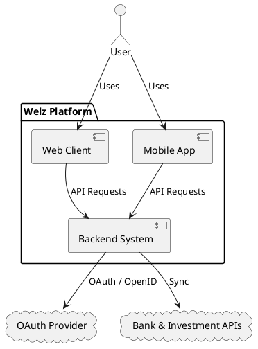
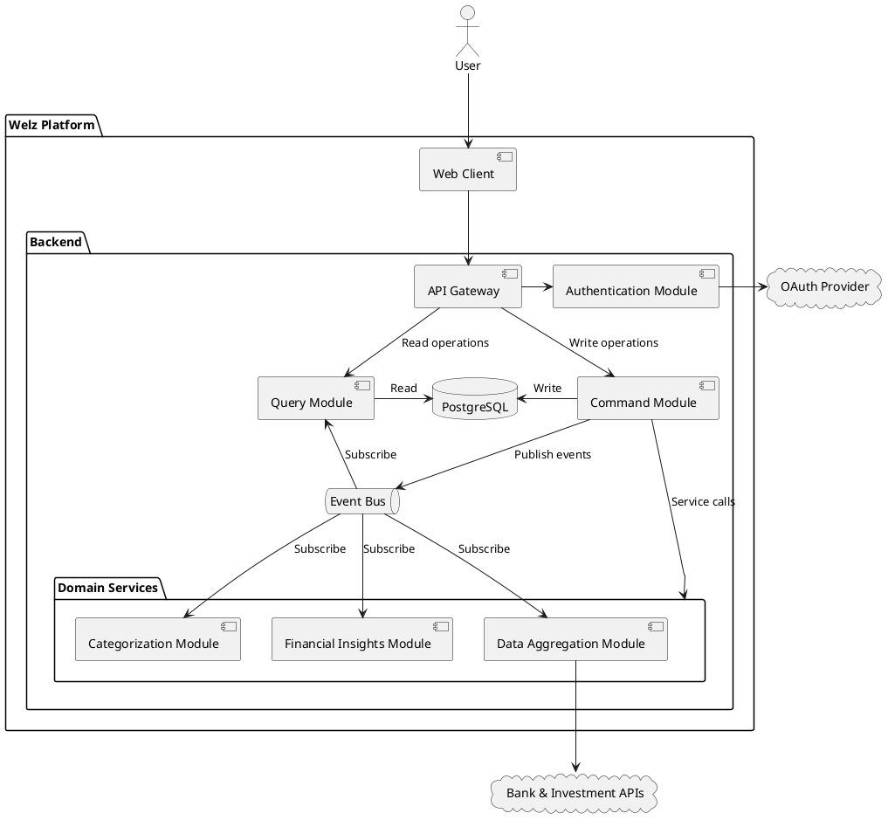
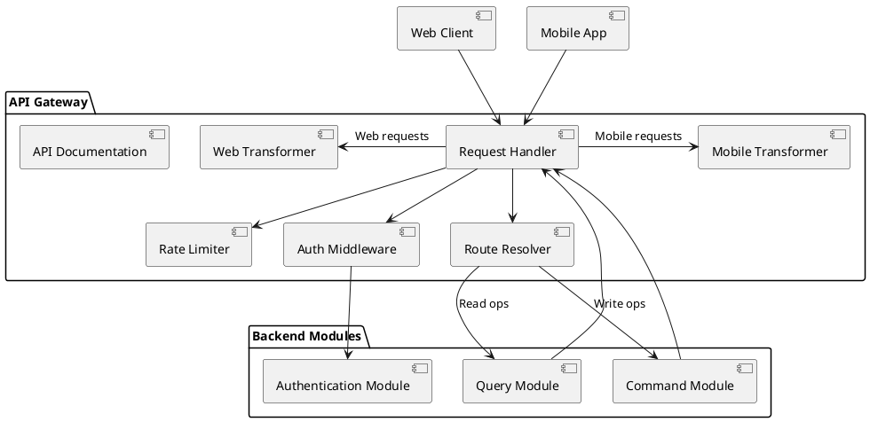
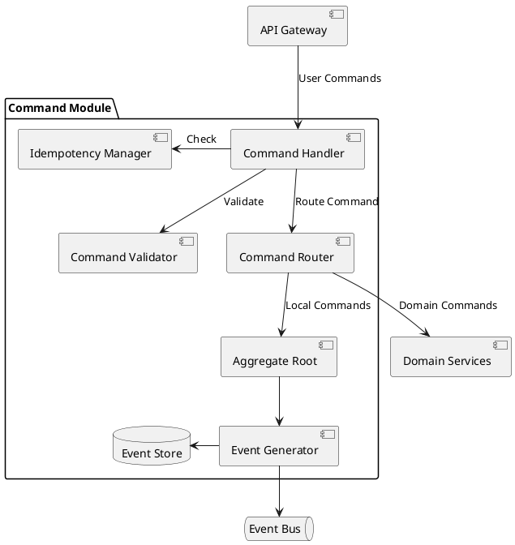
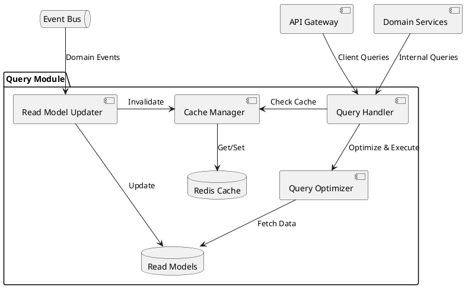
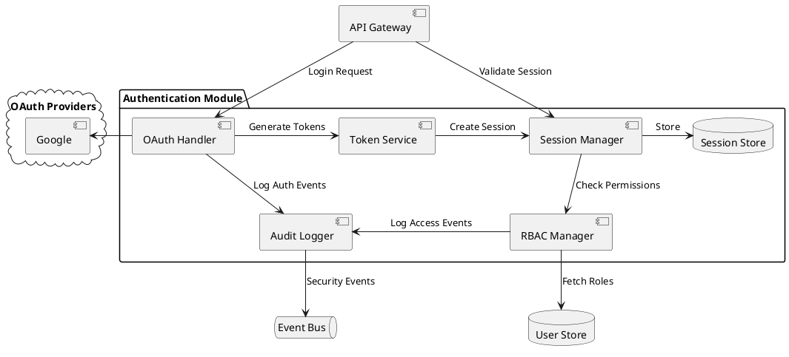
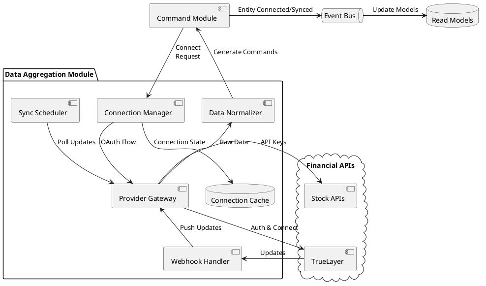
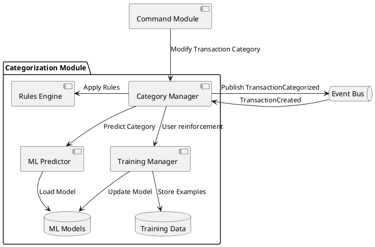
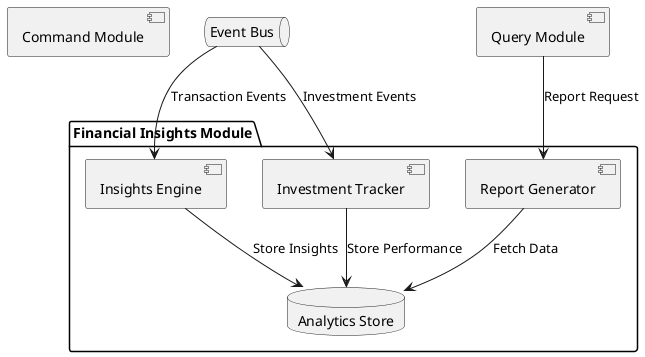

# Architecture

## Table of Contents
- [Technical Stack](#technical-stack)
  - [Frontend](#frontend)
  - [Backend](#backend)
- [Architecture Patterns](#architecture-patterns)
  - [Domain-Driven Design (DDD)](#domain-driven-design-ddd)
  - [CQRS/ES Implementation](#cqrses-implementation)
  - [SOLID Principles](#solid-principles)
  - [DRY (Don't Repeat Yourself)](#dry-dont-repeat-yourself)
  - [Clean Code Principles](#clean-code-principles)
- [High-Level Design](#high-level-design)
  - [System Overview](#system-overview)
  - [Core Components & Interactions](#core-components--interactions)
- [Infrastructure](#infrastructure)
- [Deployment Model](#deployment-model)
- [Security Considerations](#security-considerations)
- [C4 diagrams](#c4-diagrams)
  - [Context Diagram](#context-diagram)
  - [Container Diagram](#container-diagram)
- [Component Diagrams](#component-diagrams)
  - [API Gateway Module](#api-gateway-module)
  - [Command Module](#command-module)
  - [Query Module](#query-module)
  - [Authentication & Authorization Module](#authentication--authorization-module)
  - [Data Aggregation Module](#data-aggregation-module)
  - [Categorization Module](#categorization-module)
  - [Financial Insights Module](#financial-insights-module)
- [Project Structure](#project-structure)
- [Installation Guide](#installation-guide)

## Technical Stack

### Frontend
- **Web Client**: 
  - Framework: Deno Fresh (Islands Architecture)
  - Language: TypeScript
  - State Management: Effect TS
  - UI Components: Preact with Tailwind CSS
- **Mobile Client**:
  - Framework: React Native
  - Language: TypeScript
  - State Management: Effect TS
  - UI Components: Native components with custom styling

### Backend
- **Runtime**: Deno
- **Framework**: Fresh for backend APIs
- **Core Libraries**: 
  - Effect TS for functional programming and error handling
  - Preact for UI components
  - Tailwind for styling
  - TrueLayer SDK for financial data aggregation
  - Redis for event bus and caching
- **Database**: 
  - PostgreSQL with Effect TS query builders
  - EventStoreDB for event sourcing
  - Nessie for database migrations
- **Additional Libraries**:
  - Redis for event bus and read model cache
  - PostgreSQL for read models

## Architecture Patterns

### Domain-Driven Design (DDD)
The system follows DDD principles to maintain a clear separation of concerns and ensure business logic is properly encapsulated:

#### Strategic Design
- **Bounded Contexts**:
  - Financial Accounts
  - Transactions & Categorization
  - Budgeting & Goals
  - Analytics & Insights

#### Tactical Design
- **Aggregates**:
  - Account (root) → Transactions
  - Category (root) → Transaction Categories, Rules
  - User (root) → Preferences, Connections
  
- **Value Objects**:
  - Money (amount + currency)
  - CategoryRule
  - DateRange
  - TransactionMetadata

- **Domain Events**:
  - TransactionCreated
  - TransactionCategorized
  - AccountConnected
  - AccountBalanceUpdated
  - InsightGenerated

- **Repositories**:
  - AccountRepository
  - TransactionRepository
  - BudgetRepository
  - CategoryRepository

### CQRS/ES Implementation
The system implements Command Query Responsibility Segregation (CQRS) with Event Sourcing (ES) to achieve:
- Clear separation between write and read operations
- Audit trail and time travel capabilities through event sourcing
- Optimized read models for different client needs
- Eventual consistency with immediate read-your-writes

#### Event Store
- Uses EventStoreDB to store all events
- Events are immutable and represent facts that happened
- Aggregate roots ensure consistency boundaries
- Event streams organized by aggregate type and ID

#### Read Models
- Optimized for specific query needs
- Updated asynchronously via event handlers
- Cached in Redis for performance
- Separate models for web and mobile clients when needed

### SOLID Principles

#### Single Responsibility Principle (SRP)
- Each module has one reason to change
- Clear separation between command and query responsibilities
- Dedicated services for specific domain operations

#### Open/Closed Principle (OCP)
- Extensible command/query handlers
- Plugin-based provider architecture for financial institutions
- Category rules system supports custom rules

#### Liskov Substitution Principle (LSP)
- Abstract financial provider interfaces
- Interchangeable storage implementations
- Consistent event handling contracts

#### Interface Segregation Principle (ISP)
- Specific command/query interfaces
- Targeted repository interfaces
- Granular service contracts

#### Dependency Inversion Principle (DIP)
- Core domain logic depends on abstractions
- Infrastructure implementations injected at runtime
- Effect TS for functional dependencies

### DRY (Don't Repeat Yourself)

#### Code Reuse Strategy
- Shared domain models across bounded contexts
- Common validation rules
- Reusable UI components
- Shared test utilities

#### Infrastructure Patterns
- Generic repository implementations
- Common error handling
- Unified logging approach
- Shared authentication middleware

### Clean Code Principles

#### Naming Conventions
- **Intention-Revealing Names**
  - Commands: `CreateTransactionCommand`, `UpdateBudgetCommand`
  - Queries: `GetTransactionsByDateQuery`, `GetNetWorthQuery`
  - Events: `TransactionCreatedEvent`
  - Services: `TransactionNormalizationService`, `CategoryPredictionService`

#### Function Design
- **Small and Focused**
  - Each function does one thing
  - Maximum 20 lines per function
  - Clear input/output contracts
  - Early returns for validation

#### Code Organization
- **Consistent File Structure**
  - Separate commands, queries, and events
  - Group related domain logic
  - Consistent module organization
  - Clear dependency hierarchy

#### Error Handling
- **Functional Error Management**
  - Effect TS for error handling
  - Clear error hierarchies
  - Meaningful error messages
  - Proper error logging

#### Testing Approach
- **Test-First Development**
  - Unit tests for business logic
  - Integration tests for workflows
  - E2E tests for critical paths
  - Clear test naming and structure

#### Comments and Documentation
- **Self-Documenting Code**
  - Clear function and variable names
  - Documented public APIs
  - Architecture decision records
  - Essential business logic comments

## High-Level Design

### System Overview
The **Welz** platform consists of: 
1. **Frontend Applications** – A web-based client and a mobile application for users to manage their finances.
2. **Backend System** – A monolithic service handling authentication, data aggregation, AI-based categorization, and financial 
   insights.

The system follows a **monolithic backend architecture** but ensuring modularity within the backend to maintain clear responsibility for different functions and to allow future segregation.

### Core Components & Interactions

#### Frontend Application
- **Web Client**: Responsive web application built with Fresh
- **Mobile Applications**: React native mobile apps

#### Backend Core Components
- **API Gateway**: Entry point for all client requests
- **Command Module**: Handles all write operations and mutations
- **Query Module**: Handles all read operations and data retrieval
- **Authentication & Authorization Module**: Manages user authentication and role-based access control
- **Data Aggregation Module**: Connects to external bank and investment APIs to aggregate and normalize financial data
- **Categorization Module**: Automatically categorizes transactions, allows users to change transaction categories, and refines categorisation accuracy based on user input.
- **Financial Insights Module**: Computes real-time net worth and generates financial reports and AI-driven suggestions.
- **Event Bus**: Redis-backed event bus for async communication between modules
- **Database**: PostgreSQL for relational data storage with read replicas for queries

## Infrastructure

The infrastructure is designed to support both local development and future cloud deployment:

### CI/CD Pipeline
- **GitHub Actions** for continuous integration
  - Runs tests (unit, integration, E2E)
  - Performs static code analysis
  - Checks code formatting
  - Generates test coverage reports
  - Builds Docker images
  - Runs security scans
  - Deploys automatically

### Development Environment
- **Docker Compose** setup with:
  - PostgreSQL container
  - Redis container for caching and event bus
  - EventStoreDB container
  - Redis Commander for cache inspection

### Monitoring & Logging
- Structured logging with correlation IDs
- Performance metrics collection
- Error tracking and alerting
- Database query monitoring
- Cache hit/miss statistics
- User behavior analytics

## Deployment Model

### Local Development
1. **Docker Compose** setup for local development
   ```yaml
   services:
     app:
       build: .
       ports:
         - "8000:8000"
       volumes:
         - .:/app
     db:
       image: postgres:latest
     redis:
       image: redis:alpine
     eventstore:
       image: eventstore/eventstore
   ```

2. **Development Workflow**
   - Hot reload enabled for frontend and backend
   - Watch mode for tests
   - Local environment variables
   - Database migrations run automatically

### Production Deployment
1. **Containerization**
   - Multi-stage Docker builds
   - Minimal production images
   - Environment-specific configurations

2. **Scalability**
   - Horizontal scaling of web tier
   - Read replicas for database
   - Redis cluster for caching
   - Load balancing with health checks

## Security Considerations

### Data Protection
- **Encryption**
  - Data at rest encryption for databases
  - TLS 1.3 for all communications
  - Secure key management
  - Encrypted configuration values

### Authentication & Authorization
- **Session Management**
  - Secure session handling
  - JWT token rotation
  - CSRF protection
  - Rate limiting
  - Multi-factor authentication

### Audit & Compliance
- **Logging**
  - Security event logging and correlation
  - Access logs
  - Change audit trail
  - PII handling logs

### GDPR Compliance
- **User Rights**
  - Data export capability
  - Right to be forgotten implementation
  - Consent management
  - Data retention policies

### Financial Data Security
- **PSD2 Requirements**
  - Strong Customer Authentication
  - Secure communication with banks
  - Transaction signing
  - Fraud detection measures

## C4 diagrams

### **Context Diagram**
The context diagram provides a high-level overview of the system and its interactions with external entities.



**Description**: 
- Users interact with the Welz platform through the Web Client or Mobile App.
- Both clients send API requests to the Backend System.
- The Backend System handles authentication via an OAuth Provider and synchronizes financial data with various Bank APIs.

### **Container Diagram**



**API Gateway**
- Single entry point for all API requests
- Handles request routing, validation, and authentication
- Manages API versioning and documentation
- Implements rate limiting and request throttling
- Routes requests to Command or Query modules based on operation type

**Command Module**
- Processes write commands from external and internal sources
- Enforce domain rules and maintain data consistency
- Generate and store events in the Event Store
- Handle idempotency and retries
- Publish events to subscribers via Event Bus

**Query Module**
- Handles all read operations
- Implements caching strategies
- Uses read replicas for better performance
- Subscribes to relevant events to invalidate caches

**Authentication & Authorization Module**
- Handles user authentication via an OAuth Provider
- Manages Role-Based Access Control (RBAC) for profile sharing

**Data Aggregation Module**
- Connects to external bank and investment APIs
- Normalizes data into a unified financial model
- Synchronizes data with various Bank APIs and stores it in the Database

**Categorization Module**
- Automatically categorizes transactions based on past behavior
- Allows users to change transaction categories providing reinforcement to categorization accuracy
- Stores categorized transactions in the Database

**Financial Insights Module**
- Computes real-time net worth based on assets and liabilities
- Generates financial reports and AI-driven suggestions
- Stores financial metrics in the Database

**Event Bus**
- Redis-backed event bus for async communication between modules

**Database**
- PostgreSQL for relational data storage
- Ensures efficient and structured data access

## Component Diagrams

### API Gateway Module

The API Gateway Module serves as the unified entry point for all external requests, with client-specific response transformation for web and mobile clients.

#### Core Responsibilities:
- Process all incoming requests
- Route requests to Command or Query modules based on operation type
- Implement unified authentication and authorization
- Apply rate limiting and request throttling
- Transform responses based on client type and version
- Provide unified error handling and logging
- Monitor API health and metrics

#### Component Diagram:


#### **Component Details:**

**Request Handler**
- Unified entry point for all HTTP requests
- Client type detection and routing
- Request lifecycle management
- Circuit breaking for downstream services
- Response transformer selection

**Auth Middleware**
- Unified token validation for all clients
- Role-based access control
- Session management
- Device-specific authentication flows

**Rate Limiter**
- Unified rate limiting strategy
- Client-specific quota management
- Rate limit headers in responses

**Route Resolver**
- Command/Query operation routing
- Unified timeout policies
- Core business logic routing

**Web Transformer**
- Web-specific response formats
- Desktop browser optimizations
- Web-specific caching strategies

**Mobile Transformer**
- Mobile-optimized payloads
- Version-specific transformations
- Bandwidth-conscious compression
- Partial response support

**API Documentation**
- OpenAPI/Swagger specifications
- Client-specific examples
- Error responses
- Version compatibility matrices

### Command Module

The Command Module handles all write operations in the system, serving as the single entry point for both API and internal commands from domain modules.

#### **Core Responsibilities:**
- Process write commands from external and internal sources
- Enforce domain rules and maintain data consistency
- Generate and store events in the Event Store
- Handle idempotency and retries
- Publish events to subscribers via Event Bus

#### **Component Diagram:**


#### Component Details:

**Command Handler**
- Processes incoming commands from API Gateway
- Orchestrates command validation and execution
- Manages transaction boundaries
- Implements retry policies
- Returns command execution results

**Command Validator**
- Validates command structure and data
- Checks business rules and constraints
- Validates aggregate state transitions
- Enforces authorization rules
- Returns early on validation failures

**Aggregate Root**
- Maintains consistency boundaries
- Enforces invariants
- Manages entity state
- Generates domain events
- Ensures event ordering

**Event Generator**
- Creates versioned event objects
- Adds metadata and timestamps
- Manages event versioning
- Handles event schema evolution
- Ensures event immutability

**Idempotency Manager**
- Tracks processed commands
- Prevents duplicate processing
- Manages idempotency keys
- Handles concurrent commands
- Maintains command status

**Command Router**
- Routes commands to domain services
- Maintains domain command registry
- Handles command responses
- Manages command timeouts
- Provides circuit breaking

### Query Module

The Query Module handles all read operations, managing optimized read models and caching strategies for different client needs.

#### Core Responsibilities:
- Process read queries
- Maintain optimized read models
- Transform query results for different clients
- Subscribe to relevant events for model updates
- Implement caching strategies

#### Component Diagram:


#### Component Details:

**Query Handler**
- Routes queries to appropriate handlers
- Implements query timeout policies
- Manages response transformation
- Handles partial response requests
- Returns cached/live data based on freshness requirements

**Cache Manager**
- Implements multi-level caching
- Manages cache invalidation
- Handles cache warming
- Supports different caching strategies per query type
- Provides cache statistics and monitoring

**Read Model Updater**
- Subscribes to domain events
- Updates read models asynchronously
- Maintains read model consistency
- Handles event ordering and versioning
- Manages model migrations

**Query Optimizer**
- Optimizes query execution plans
- Manages database connection pool
- Implements query result pagination
- Handles sorting and filtering
- Monitors query performance

### Authentication & Authorization Module

The Authentication & Authorization Module manages user identity, access control, and secure session handling across all platform interfaces.

#### Core Responsibilities:
- Implement OAuth2/OpenID Connect flows
- Manage user sessions and tokens
- Enforce role-based access control (RBAC)
- Handle multi-device authentication
- Provide audit logging of security events

#### Component Diagram:


#### Component Details:

**OAuth Handler**
- Implements OAuth2/OpenID Connect flows
- Manages provider-specific authentication
- Handles token exchange
- Validates OAuth responses
- Supports Google as provider

**Session Manager**
- Creates and validates sessions
- Manages session lifecycle
- Handles session expiration
- Supports multiple devices
- Implements session revocation

**Token Service**
- Generates JWT tokens
- Handles token refresh
- Manages token blacklisting
- Implements token rotation
- Ensures token security

**RBAC Manager**
- Manages role definitions
- Enforces access policies
- Handles permission inheritance
- Supports dynamic roles
- Validates access rights

**Audit Logger**
- Logs security events
- Tracks auth attempts
- Records permission changes
- Maintains audit trail
- Supports compliance reporting

### Data Aggregation Module

The Data Aggregation Module orchestrates the synchronization of financial data from multiple providers, handling both webhook-based and polling-based updates.

#### Core Responsibilities:
- Manage financial institution connections
- Handle provider-specific OAuth flows
- Process webhooks and polling updates
- Normalize data across providers
- Ensure data consistency and freshness

#### Component Diagram:


#### Component Details:

**Connection Manager**
- Handles provider OAuth flows
- Manages API credentials
- Maintains connection state
- Implements retry logic
- Monitors provider health

**Provider Gateway**
- Implements provider APIs
- Handles rate limiting
- Manages API versioning
- Supports multiple providers
- Implements failover logic

**Webhook Handler**
- Processes TrueLayer webhooks
- Validates webhook signatures
- Handles duplicate events
- Manages webhook registration
- Monitors webhook health

**Sync Scheduler**
- Manages polling intervals
- Handles provider timeouts
- Implements backoff strategy
- Coordinates parallel syncs
- Tracks sync status

**Data Normalizer**
- Standardizes data formats
- Resolves data conflicts
- Enriches transaction data
- Validates data integrity
- Generates domain events

### Categorization Module

The Categorization Module provides automatic transaction categorization using AI/ML techniques and learns from user category modifications.

#### **Core Responsibilities:**
- Automatically categorize new transactions
- Learn from user category modifications
- Maintain categorization rules
- Handle bulk categorization
- Continuously improve categorization accuracy

#### **Component Diagram:**


#### **Component Details:**

**Category Manager**
- Orchestrates categorization workflow
- Manages category hierarchy
- Handles user overrides
- Coordinates prediction requests
- Publishes categorization events

**ML Predictor**
- Loads trained ML models
- Makes category predictions
- Handles prediction errors
- Provides confidence scores
- Supports model versioning

**Rules Engine**
- Applies predefined rules
- Handles regex patterns
- Manages rule priorities
- Supports custom rules
- Validates rule syntax

**Training Manager**
- Collects training examples
- Updates model periodically
- Validates training data
- Monitors model performance
- Manages model deployment

### Financial Insights Module

The Financial Insights Module processes financial data to provide real-time insights, reports, and budget tracking.

#### **Core Responsibilities:**
- Calculate real-time net worth across all accounts
- Generate periodic financial reports with category breakdowns
- Track spending patterns and trends
- Monitor investment performance

#### Component Diagram:


#### Component Details:

**Insights Engine**
- Processes transaction events
- Performs financial calculations
- Generates trend analysis
- Tracks recurring expenses
- Identifies spending patterns

**Report Generator**
- Creates periodic reports
- Supports custom report periods
- Generates visualizations
- Exports in multiple formats
- Handles report scheduling

**Investment Tracker**
- Monitors investment returns
- Tracks portfolio performance
- Calculates risk metrics
- Provides market insights
- Analyzes asset allocation

## Project Structure

```
/
├── apps/                       # Application code
│   ├── backend/               # Backend monolith
│   │   ├── src/
│   │   │   ├── domain/       # Domain model and aggregates
│   │   │   │   ├── account/  # Account aggregate
│   │   │   │   ├── transaction/ # Transaction aggregate
│   │   │   │   └── category/ # Category aggregate
│   │   │   ├── application/  # Application services
│   │   │   │   ├── commands/ # Command handlers
│   │   │   │   ├── queries/  # Query handlers
│   │   │   │   └── events/   # Event handlers
│   │   │   ├── infrastructure/ # Technical implementations
│   │   │   │   ├── db/      # Database access
│   │   │   │   └── eventbus/ # In-memory event bus
│   │   │   ├── interface/    # Interface adapters
│   │   │   └── shared/       # Shared utilities
│   │   ├── db/              # Database management
│   │   │   ├── migrations/  # Nessie migrations
│   │   │   └── seeds/      # Initial data seeds
│   │   └── nessie.config.ts    # Nessie configuration
│   │   └── tests/          # Test suites
│   │   └── deno.json
│   │
│   └── web/                    # Frontend web application
│       ├── routes/             # Fresh routes
│       ├── islands/            # Interactive components
│       └── components/         # UI components
│       ├── tests/
│       └── fresh.config.ts
│
├── packages/                   # Shared packages
│   ├── types/                  # Type definitions
│   ├── validation/             # Validation rules
│   └── utils/                  # Shared utilities
│
├── tools/                      # Development tools
│   └── scripts/                # Build and maintenance
│   └── generators/             # Code generators
│
├── configs/                    # Configuration files
│   ├── backend/
│   │   ├── default.ts
│   │   ├── development.ts
│   │   └── production.ts
│   └── web/
│       ├── default.ts
│       └── environment.ts
│
├── docs/                       # Documentation
│   ├── model/         # Domain documentation
│   ├── api/           # API documentation
│   └── architecture.md
│
├── infra/                      # Infrastructure configuration
│   ├── docker/                 # Docker configurations
│   │   ├── development/
│   │   └── production/
│   └── kubernetes/             # Kubernetes manifests (future use)
│
└── .github/                    # GitHub configurations
    ├── workflows/              # GitHub Actions
    └── ISSUE_TEMPLATE/         # Issue templates
```

### File Naming Conventions

#### Backend
- Domain entities: `Entity.ts`
- Commands: `EntityCommand.ts`
- Queries: `EntityQuery.ts`
- Services: `EntityService.ts`
- Controllers: `EntityController.ts`
- Tests: `Entity.test.ts`

#### Frontend
- Pages: `EntityPage.tsx`
- Islands: `EntityIsland.tsx`
- Components: `EntityComponent.tsx`
- Layouts: `EntityLayout.tsx`
- Styles: `Entity.css.ts`

### Database Migration Strategy

#### Tools and Setup
- **Nessie**: Type-safe database migration tool for Deno
- Version-controlled migrations
- Forward and reverse migrations support
- Seed data management
- Migration status tracking

#### Migration Naming Convention
```typescript
// Example migration file: db/migrations/timestamps/20240101T120000_create_accounts.ts
import { AbstractMigration, Info } from "https://deno.land/x/nessie/mod.ts";

export default class extends AbstractMigration {
  /** Runs on migrate */
  async up(info: Info): Promise<void> {
    await this.client.queryArray(`
      CREATE TABLE accounts (
        id UUID PRIMARY KEY DEFAULT gen_random_uuid(),
        name VARCHAR(255) NOT NULL,
        type VARCHAR(50) NOT NULL,
        balance DECIMAL(19,4) NOT NULL DEFAULT 0,
        currency CHAR(3) NOT NULL,
        created_at TIMESTAMP WITH TIME ZONE DEFAULT CURRENT_TIMESTAMP,
        updated_at TIMESTAMP WITH TIME ZONE DEFAULT CURRENT_TIMESTAMP
      );
    `);
  }

  /** Runs on rollback */
  async down(info: Info): Promise<void> {
    await this.client.queryArray(`DROP TABLE accounts;`);
  }
}
```

## Installation Guide

### Prerequisites
- Deno
- Docker & Docker Compose

### Local Development Setup

1. **Install**
```bash
# Install Deno dependencies
deno cache deps.ts
```

2. **Database Setup**
```bash
# Start PostgreSQL container
docker compose up db -d

# Create database
docker compose exec db createdb -U postgres welz

# Run migrations using Nessie
deno task nessie migrate

# Seed initial data
deno task nessie seed
```

3. **Start Services**
```bash
# Start backend and frontend
deno task dev

# Run tests
deno task test
```
