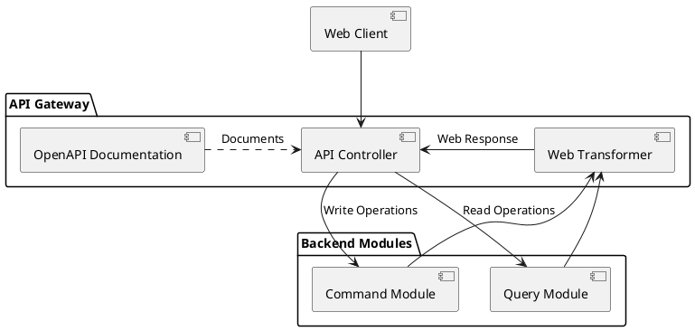
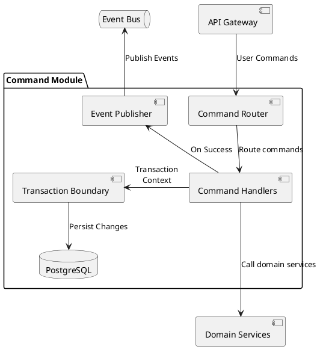
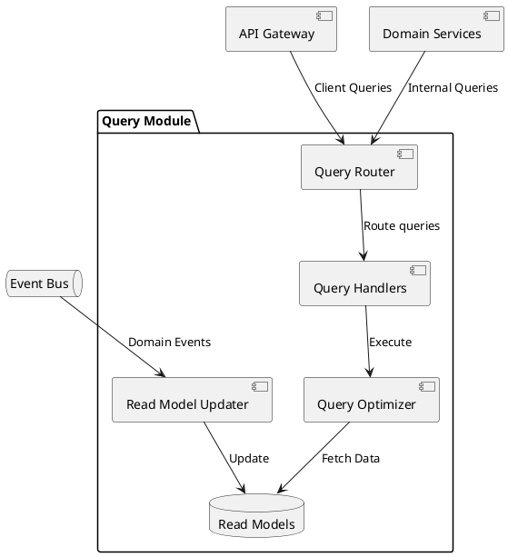

# Architecture

## Table of Contents

- [Technical Stack](#technical-stack)
  - [Frontend](#frontend)
  - [Backend](#backend)
- [Architecture Patterns](#architecture-patterns)
  - [Domain-Driven Design (DDD)](#domain-driven-design-ddd)
  - [CQRS Implementation](#cqrs-implementation)
  - [SOLID Principles](#solid-principles)
  - [DRY (Don't Repeat Yourself)](#dry-dont-repeat-yourself)
  - [Clean Code Principles](#clean-code-principles)
- [High-Level Design](#high-level-design)
  - [System Overview](#system-overview)
  - [Core Components & Interactions](#core-components--interactions)
- [Infrastructure](#infrastructure)
- [Deployment Model](#deployment-model)
- [Security Considerations](#security-considerations)
- [C4 diagrams](#c4-diagrams)
  - [Context Diagram](#context-diagram)
  - [Container Diagram](#container-diagram)
- [Component Diagrams](#component-diagrams)
  - [API Gateway Module](#api-gateway-module)
  - [Command Module](#command-module)
  - [Query Module](#query-module)
  - [Categorization Module](#categorization-module)
  - [Financial Insights Module](#financial-insights-module)
- [Project Structure](#project-structure)
- [Installation Guide](#installation-guide)

## Technical Stack

### Frontend

- **Web Client**:
  - Framework: Deno Fresh (Islands Architecture)
  - Language: TypeScript
  - State Management: Effect TS
  - UI Components: Preact with Tailwind CSS

### Backend

- **Runtime**: Deno
- **Framework**: Fresh for backend APIs
- **Core Libraries**:
  - Effect TS for functional programming and error handling
  - Preact for UI components
  - Tailwind for styling
- **Database**:
  - PostgreSQL with Effect TS query builders
  - Nessie for database migrations

## Architecture Patterns

### Domain-Driven Design (DDD)

#### Strategic Design

- **Bounded Contexts**:
  - Financial Accounts
  - Transactions & Categorization
  - Analytics & Insights

#### Tactical Design

- **Aggregates**:
  - Account (root) → Transactions
  - Category (root) → Transaction Categories

- **Value Objects**:
  - Money (amount + currency)
  - DateRange
  - TransactionMetadata

- **Domain Events**:
  - TransactionCreated
  - TransactionCategorized
  - AccountBalanceUpdated
  - CategoryInsightsCalculated

- **Repositories**:
  - AccountRepository
  - TransactionRepository
  - CategoryRepository

### CQRS Implementation

The system implements a simplified CQRS pattern to achieve:

- Clear separation between write and read operations
- Commands store in normalized tables
- Queries use materialized views
- Strong consistency model through PostgreSQL
- Simple in-memory event bus for module communication

#### Event Bus Implementation

- In-memory pub/sub pattern using Effect TS
- Simple topic-based subscription model
- Synchronous event processing
- No event persistence (events are ephemeral)

#### Command Handling

- Resource-based REST endpoints for write operations
- Effect Schema for validation
- Transactions through Effect context
- Events published after successful commands
- Type-safe command handling

Example Flow:

```
POST /accounts
{
  "name": "Savings",
  "initialBalance": 1000,
  "currency": "EUR"
}

-> CreateAccountCommand
-> Transaction Boundary
-> Database Write
-> Publish AccountCreated Event
-> Response
```

#### Query Handling

- Resource-based REST endpoints for read operations
- Materialized views for efficient reads
- Views are refreshed on relevant domain events
- Built-in PostgreSQL query optimization

### SOLID Principles

#### Single Responsibility Principle (SRP)

- Each module has one reason to change
- Clear separation between command and query responsibilities
- Dedicated services for specific domain operations

#### Open/Closed Principle (OCP)

- Extensible command/query handlers
- Plugin-based provider architecture for financial institutions
- Category rules system supports custom rules

#### Liskov Substitution Principle (LSP)

- Abstract financial provider interfaces
- Interchangeable storage implementations

#### Interface Segregation Principle (ISP)

- Specific command/query interfaces
- Targeted repository interfaces
- Granular service contracts

#### Dependency Inversion Principle (DIP)

- Core domain logic depends on abstractions
- Infrastructure implementations injected at runtime
- Effect TS for functional dependencies

### DRY (Don't Repeat Yourself)

#### Code Reuse Strategy

- Shared domain models across bounded contexts
- Common validation rules
- Reusable UI components
- Shared test utilities

#### Infrastructure Patterns

- Generic repository implementations
- Common error handling
- Unified logging approach
- Shared authentication middleware

### Clean Code Principles

#### Naming Conventions

- **Intention-Revealing Names**
  - Commands: `CreateTransactionCommand`, `UpdateBudgetCommand`
  - Queries: `GetTransactionsByDateQuery`, `GetNetWorthQuery`
  - Services: `TransactionNormalizationService`, `CategoryPredictionService`

#### Function Design

- **Small and Focused**
  - Each function does one thing
  - Maximum 20 lines per function
  - Clear input/output contracts
  - Early returns for validation

#### Code Organization

- **Consistent File Structure**
  - Separate commands and queries
  - Group related domain logic
  - Consistent module organization
  - Clear dependency hierarchy

#### Error Handling

- **Functional Error Management**
  - Effect TS for error handling
  - Clear error hierarchies
  - Meaningful error messages
  - Proper error logging

#### Testing Approach

- **Test-First Development**
  - Unit tests for business logic
  - Integration tests for workflows
  - E2E tests for critical paths
  - Clear test naming and structure

#### Comments and Documentation

- **Self-Documenting Code**
  - Clear function and variable names
  - Documented public APIs
  - Architecture decision records
  - Essential business logic comments

## High-Level Design

### System Overview

The **Welz** platform consists of:

1. **Frontend Application** – A web-based client using Fresh/Preact
2. **Backend System** – A monolithic service handling data management, categorization, and basic insights

### Core Components & Interactions

#### Frontend Application

- **Web Client**: Responsive web application built with Fresh

#### Backend Core Components

- **API Gateway**: Entry point for all client requests
- **Command Module**: Handles write operations
- **Query Module**: Handles read operations
- **Categorization Module**: Basic transaction categorization
- **Financial Insights Module**: Basic spending analytics
- **Database**: PostgreSQL for data storage

## Infrastructure

The infrastructure is designed to support both local development and future cloud deployment:

### CI/CD Pipeline

- **GitHub Actions** for continuous integration:
  - Runs tests (unit, integration)
  - Checks code formatting
  - Builds Docker images
  - Runs security scans

### Development Environment

- **Docker Compose** setup with PostgreSQL container

### Monitoring & Logging

- Basic logging with correlation IDs
- Error tracking

## Deployment Model

### Local Development

1. **Docker Compose** setup for local development
   ```yaml
   services:
     app:
       build: .
       ports:
         - '8000:8000'
       volumes:
         - .:/app
     db:
       image: postgres:latest
   ```

2. **Development Workflow**
   - Hot reload enabled for frontend and backend
   - Watch mode for tests
   - Local environment variables
   - Database migrations run automatically

### Production Deployment

1. **Containerization**
   - Single Docker image for backend
   - Environment-specific configurations
   - Production optimized builds

2. **Initial Infrastructure**
   - Single web server deployment
   - PostgreSQL database

## Security Considerations

### Data Protection

- **Encryption**
  - Data at rest encryption for databases
  - TLS 1.3 for all communications

### Authentication & Authorization

- **Session Management**
  - Basic session handling
  - Simple JWT tokens

### Audit & Compliance

- **Logging**
  - Security event logging
  - Access logs

### Financial Data Security

- **PSD2 Requirements**
  - Basic authentication
  - HTTPS encryption

## C4 diagrams

### Context Diagram


### Container Diagram


**API Gateway**

- Single entry point for all API requests
- Handles request routing, validation and authentication
- Manages API versioning and documentation
- Routes requests to Command or Query modules based on operation type

**Command Module**

- Processes write commands from external and internal sources
- Schema-based command validation
- Effect-based error handling and transactions

**Query Module**

- Handles all read operations
- Implements caching strategies
- Uses read replicas for better performance
- Subscribes to relevant events to invalidate caches

**Categorization Module**

- Automatically categorizes transactions based on past behavior
- Allows users to change transaction categories providing reinforcement to categorization accuracy
- Stores categorized transactions in the Database

**Financial Insights Module**

- Computes real-time net worth based on assets and liabilities
- Generates financial reports
- Stores financial metrics in the Database

**Database**

- PostgreSQL for relational data storage
- Ensures efficient and structured data access

## Component Diagrams

### API Gateway Module

The API Gateway Module serves as the entry point for all API requests, utilizing a unified endpoint to process commands and queries.

#### Core Responsibilities:

- Handle RESTful HTTP requests through a unified endpoint
- Basic request validation and authentication
- Transform REST operations into domain commands and queries
- Provide unified error handling and logging
- Manage response formatting
- API documentation and versioning

#### Component Diagram:



#### **Component Details:**

**API Controller**

- Single endpoint for all command and query operations
- Uses HTTP methods to differentiate between operations:
  - POST: Commands (write operations)
  - GET: Queries (read operations)
- Routes based on the operation type
- Error handling and responses
- Transforms REST requests into domain commands or queries
- Request validation through Effect Schema

**Web Transformer**

- Maps domain results to web-specific responses
- Handles error transformation
- Applies response formatting (e.g., pagination)
- Manages content negotiation
- Ensures consistent response structure

**API Documentation**

- Complete OpenAPI endpoint documentation
- Request/response schemas
- Example payloads
- Error responses
- Interactive Swagger UI for testing

#### Command Flow Example:

```http
POST /api
Content-Type: application/json

{
  "type": "CreateAccount",
  "name": "Savings",
  "initialBalance": 1000,
  "currency": "EUR"
}
```

Response:

```http
HTTP/1.1 201 Created
Content-Type: application/json

{
  "id": "uuid-123",
  "name": "Savings",
  "currency": "EUR"
}
```

#### Query Flow Example:

```http
GET /api?type=GetAccountTransactions&accountId=123&fromDate=2023-01-01&toDate=2023-01-31
```

Response:

```http
HTTP/1.1 200 OK
Content-Type: application/json

{
  "transactions": [
    {
      "id": "tx-1",
      "amount": 45.99,
      "date": "2023-01-15T10:30:00Z",
      "description": "Grocery Store"
    },
    // ...more transactions
  ],
  "pagination": {
    "page": 1,
    "pageSize": 10,
    "totalItems": 24
  }
}
```

### Command Module

The Command Module processes all write operations providing transaction boundaries.

#### **Core Responsibilities:**

- Process write commands using discriminated unions for type safety
- Schema-based command validation
- Transaction management through Effect context
- Event publishing after successful execution

#### **Component Diagram:**



#### Component Details:

**Command Router**

- Handles domain commands from API Gateway
- Command validation through schemas
- Effect-based error handling

**Command Handlers**

- Implement business logic for specific commands
- Domain service orchestration
- Transactional boundaries
- State changes through aggregates
- Error handling and validation
- Event publishing on successful execution

**Transaction Boundary**

- Manages database transactions
- Automatic rollback on errors
- Effect context for transaction scope

**Event Publisher**

- Publishes domain events after successful commands
- Maintains event ordering
- Provides correlation IDs
- Handles publishing errors

#### Command Flow Example:

```typescript
// From API Gateway
CreateTransactionCommand {
  type: "CreateTransaction",
  accountId: "account-123",
  amount: {
    amount: 1000n,
    currency: "EUR"
  },
  date: new Date(),
  description: "Monthly rent"
}

// Through Command Handler
-> Validate schema
-> Check account exists and has balance (Domain Service)
-> Execute in transaction boundary
-> Persist to database
-> Publish TransactionCreatedEvent
-> Return success response
```

### Query Module

The Query Module handles all read operations, managing optimized read models and caching strategies for different client needs.

#### Core Responsibilities:

- Process read queries
- Maintain optimized read models
- Transform query results
- Subscribe to relevant events

#### Component Diagram:



#### Component Details:

**Query Router**

- Routes queries to appropriate handlers
- Manages response transformation
- Handles pagination requests

**Query Handlers**

- Process specific query types (e.g., GetTransaction, GetUser)
- Read from optimized query models
- Handle data filtering and sorting
- Manage query parameters validation
- Implement caching strategies
- Apply pagination and result limiting
- Handle query-specific error cases

**Read Model Updater**

- Subscribes to domain events
- Updates read models by refreshing materialized views
- Maintains model consistency

**Query Optimizer**

- Basic query execution plans
- Implements pagination
- Handles basic sorting and filtering

#### Query Flow Example:

```
GET /api?type=GetAccountTransactions&accountId=123&fromDate=2023-01-01&toDate=2023-01-31

-> GetAccountTransactionsQuery
-> Query Handler
-> Read Model
-> Response with paginated transactions
```

### Categorization Module

The Categorization Module provides transaction categorization.

#### Core Responsibilities:

- Basic transaction categorization
- Handle user category updates
- Process categorization business logic

#### Component Diagram:


#### **Component Details:**

**Category Manager**

- Orchestrates categorization workflow
- Manages category hierarchy
- Handles user overrides
- Coordinates prediction requests
- Publishes categorization events

### Financial Insights Module

The Financial Insights Module processes financial data to provide real-time insights and reports.

#### Core Responsibilities:

- Calculate basic net worth
- Generate category breakdowns
- Track monthly trends

#### Component Diagram:


#### Component Details:

**Insights Engine**

- Receives domain events (transactions, categories)
- Performs financial calculations
- Creates analytics commands for persistence

**Report Generator**

- Handles report requests
- Uses Query Module to access pre-calculated data
- Formats data for presentation

## Project Structure

```
/
├── apps/                        # Application code
│   ├── backend/                 # Backend monolith
│   │   ├── src/
│   │   │   ├── domain/          # Domain model and aggregates
│   │   │   │   ├── aggregate/   # Root aggregates
│   │   │   │   ├── command/     # Command types and schemas
│   │   │   │   └── query/       # Query types and schemas
│   │   │   ├── application/     # Application services
│   │   │   │   ├── account/     # Account-related handlers
│   │   │   │   └── transaction/ # Transaction-related handlers
│   │   │   ├── infrastructure/  # Technical implementations
│   │   │   │   ├── db/          # Database access
│   │   │   │   ├── http/        # HTTP controllers
│   │   │   │   └── eventbus/    # In-memory event bus
│   │   │   └── shared/          # Shared utilities
│   │   ├── db/                  # Database management
│   │   │   ├── migration/       # Nessie migrations
│   │   │   └── seed /           # Initial data seeds
│   │   └── tests/               # Test suites
│   │
│   └── web/                     # Frontend application
│       ├── routes/              # Fresh routes
│       ├── islands/             # Interactive components
│       │   ├── transactions/    # Transaction management
│       │   ├── insights/        # Financial insights
│       │   └── shared/          # Shared islands
│       └── components/          # UI components
│
├── packages/                    # Shared code
│   ├── types/                   # Type definitions
│   ├── validation/              # Validation rules
│   └── utils/                   # Shared utilities
│
├── tools/                       # Development tools
│   └── scripts/                 # Build and maintenance
│
├── docs/                        # Documentation
│   ├── model/                   # Domain documentation
│   └── api/                     # API documentation
│
└── infra/                       # Infrastructure
    └── docker/                  # Docker configurations
```

### File Naming Conventions

#### Backend

- Domain entities: `Entity.ts`
- Commands: `EntityCommand.ts`
- Queries: `EntityQuery.ts`
- Services: `EntityService.ts`
- Controllers: `EntityController.ts`
- Tests: `Entity.test.ts`

#### Frontend

- Pages: `EntityPage.tsx`
- Islands: `EntityIsland.tsx`
- Components: `EntityComponent.tsx`
- Layouts: `EntityLayout.tsx`
- Styles: `Entity.css.ts`

### Database Migration Strategy

#### Tools and Setup

- **Nessie**: Type-safe database migration tool for Deno
- Version-controlled migrations
- Forward and reverse migrations support
- Seed data management
- Migration status tracking

#### Migration Naming Convention

```typescript
// Example migration file: db/migrations/timestamps/20240101T120000_create_accounts.ts
import { AbstractMigration, Info } from 'https://deno.land/x/nessie/mod.ts';

export default class extends AbstractMigration {
  /** Runs on migrate */
  async up(info: Info): Promise<void> {
    await this.client.queryArray(`
      CREATE TABLE accounts (
        id UUID PRIMARY KEY DEFAULT gen_random_uuid(),
        name VARCHAR(255) NOT NULL,
        type VARCHAR(50) NOT NULL,
        balance DECIMAL(19,4) NOT NULL DEFAULT 0,
        currency CHAR(3) NOT NULL,
        created_at TIMESTAMP WITH TIME ZONE DEFAULT CURRENT_TIMESTAMP,
        updated_at TIMESTAMP WITH TIME ZONE DEFAULT CURRENT_TIMESTAMP
      );
    `);
  }

  /** Runs on rollback */
  async down(info: Info): Promise<void> {
    await this.client.queryArray(`DROP TABLE accounts;`);
  }
}
```

## Installation Guide

### Prerequisites

- Deno
- Docker & Docker Compose

### Local Development Setup

1. **Install**

```bash
# Install Deno dependencies
deno cache deps.ts
```

2. **Database Setup**

```bash
# Start PostgreSQL container
docker compose up db -d

# Create database
docker compose exec db createdb -U postgres welz

# Run migrations using Nessie
deno task nessie migrate

# Seed initial data
deno task nessie seed
```

3. **Start Services**

```bash
# Start backend and frontend
deno task dev

# Run tests
deno task test
```
