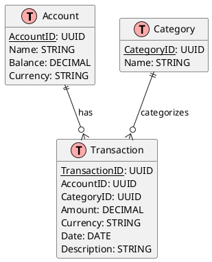

# Database Schema

## Table of Contents

- [Overview](#overview)
- [Entity-Relationship Diagram](#entity-relationship-diagram)
- [Domain Tables (Command Side)](#domain-tables)
- [Materialized Views (Query Side)](#materialized-views)
- [Supporting Tables](#supporting-tables)

## Overview

This document defines the database schema for our CQRS implementation:

- Domain Tables: Source of truth, normalized data structure
- Materialized Views: Pre-calculated, denormalized read models
- Supporting Tables: Infrastructure-related data

## Entity-Relationship Diagram

## Domain Tables

### accounts

**Purpose**: Source of truth for all financial accounts and their current balances.

| Column     | Type          | Description                           | Constraints                         |
| ---------- | ------------- | ------------------------------------- | ----------------------------------- |
| id         | UUID          | Unique account identifier             | PRIMARY KEY                         |
| name       | VARCHAR(255)  | User-defined account name for display | NOT NULL                            |
| type       | VARCHAR(20)   | Account classification (CASH/BANK)    | CHECK (type IN ('CASH', 'BANK'))    |
| balance    | DECIMAL(19,4) | Current monetary balance              | NOT NULL, DEFAULT 0                 |
| currency   | CHAR(3)       | ISO 4217 currency code                | NOT NULL                            |
| created_at | TIMESTAMPTZ   | Account creation timestamp            | NOT NULL, DEFAULT CURRENT_TIMESTAMP |
| updated_at | TIMESTAMPTZ   | Last balance update timestamp         | NOT NULL, DEFAULT CURRENT_TIMESTAMP |

### transactions

Stores all financial transactions.

| Column      | Type          | Description                 | Constraints                         |
| ----------- | ------------- | --------------------------- | ----------------------------------- |
| id          | UUID          | Unique identifier           | PRIMARY KEY                         |
| account_id  | UUID          | Reference to source account | FOREIGN KEY (accounts), NOT NULL    |
| amount      | DECIMAL(19,4) | Transaction amount          | NOT NULL                            |
| currency    | CHAR(3)       | ISO currency code           | NOT NULL                            |
| date        | DATE          | Transaction date            | NOT NULL                            |
| description | TEXT          | Transaction description     | NOT NULL                            |
| category_id | UUID          | Reference to category       | FOREIGN KEY (categories)            |
| created_at  | TIMESTAMPTZ   | Creation timestamp          | NOT NULL, DEFAULT CURRENT_TIMESTAMP |
| updated_at  | TIMESTAMPTZ   | Last update timestamp       | NOT NULL, DEFAULT CURRENT_TIMESTAMP |

### categories

Defines transaction categorization system.

| Column     | Type         | Description                  | Constraints                           |
| ---------- | ------------ | ---------------------------- | ------------------------------------- |
| id         | UUID         | Unique identifier            | PRIMARY KEY                           |
| name       | VARCHAR(100) | Category name                | NOT NULL, UNIQUE                      |
| type       | VARCHAR(20)  | Either 'INCOME' or 'EXPENSE' | CHECK (type IN ('INCOME', 'EXPENSE')) |
| created_at | TIMESTAMPTZ  | Creation timestamp           | NOT NULL, DEFAULT CURRENT_TIMESTAMP   |

## Read Models

### monthly_spending_by_category_view

Pre-aggregated monthly spending totals per category.

| Column            | Type          | Description               |
| ----------------- | ------------- | ------------------------- |
| month             | DATE          | Aggregation month         |
| category_id       | UUID          | Reference to category     |
| category_name     | VARCHAR(100)  | Category name             |
| category_type     | VARCHAR(20)   | 'INCOME' or 'EXPENSE'     |
| transaction_count | INTEGER       | Number of transactions    |
| total_amount      | DECIMAL(19,4) | Total amount for category |
| min_amount        | DECIMAL(19,4) | Smallest transaction      |
| max_amount        | DECIMAL(19,4) | Largest transaction       |
| avg_amount        | DECIMAL(19,4) | Average transaction size  |

### account_balances_view

Account summary with transaction statistics.

| Column            | Type          | Description                  |
| ----------------- | ------------- | ---------------------------- |
| account_id        | UUID          | Reference to account         |
| account_name      | VARCHAR(255)  | Account name                 |
| account_type      | VARCHAR(20)   | Account type                 |
| currency          | CHAR(3)       | Account currency             |
| current_balance   | DECIMAL(19,4) | Current balance              |
| transaction_count | INTEGER       | Total transactions           |
| total_income      | DECIMAL(19,4) | Sum of positive transactions |
| total_expenses    | DECIMAL(19,4) | Sum of negative transactions |

### net_worth_history_view

Daily net worth calculations.

| Column    | Type          | Description      |
| --------- | ------------- | ---------------- |
| date      | DATE          | Calculation date |
| net_worth | DECIMAL(19,4) | Total net worth  |

### transaction_categories_view

Denormalized view of transactions with their categories.

| Column         | Type          | Description           |
| -------------- | ------------- | --------------------- |
| transaction_id | UUID          | Transaction reference |
| account_id     | UUID          | Account reference     |
| amount         | DECIMAL(19,4) | Transaction value     |
| currency       | CHAR(3)       | Transaction currency  |
| date           | DATE          | Transaction date      |
| description    | TEXT          | Transaction details   |
| category_id    | UUID          | Category reference    |
| category_name  | VARCHAR(100)  | Category name         |
| category_type  | VARCHAR(20)   | INCOME or EXPENSE     |

## Supporting Tables

### idempotency_keys

**Purpose**: Prevents duplicate command processing.

| Attribute    | Type         | Description               | Constraints                         |
| ------------ | ------------ | ------------------------- | ----------------------------------- |
| key          | VARCHAR(255) | Unique command identifier | Primary Key                         |
| command_type | VARCHAR(100) | Type of command           | Not Null                            |
| expires_at   | TIMESTAMPTZ  | Expiration timestamp      | Not Null                            |
| created_at   | TIMESTAMPTZ  | Creation timestamp        | Not Null, Default CURRENT_TIMESTAMP |
