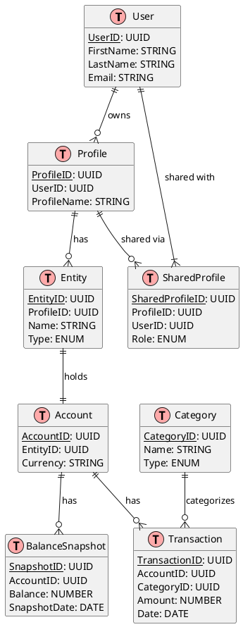

# Database Schema

## Table of Contents
- [Overview](#overview)
- [Entity-Relationship Diagram](#entity-relationship-diagram)
- [Event Store Tables](#event-store-tables)
- [Read Model Tables](#read-model-tables)
- [Supporting Tables](#supporting-tables)

## Overview
This document defines the database schema for our CQRS/ES implementation:
- Event store: Uses both EventStoreDB and PostgreSQL (for data that needs SQL queries)
- Read models: Stored in PostgreSQL
- Supporting tables: Additional PostgreSQL tables for system operations

## Entity-Relationship Diagram


## Event Store Tables

### events_view
**Purpose**: Stores domain events for SQL-based querying and analysis, complementing EventStoreDB.

```sql
CREATE TABLE events_view (
    event_id UUID PRIMARY KEY DEFAULT gen_random_uuid(), -- Unique identifier for the event
    aggregate_type VARCHAR(50) NOT NULL,                 -- Type of aggregate (e.g., "User", "Account")
    aggregate_id UUID NOT NULL,                         -- ID of the aggregate instance
    event_type VARCHAR(100) NOT NULL,                   -- Type of event (e.g., "UserCreated")
    event_version INT NOT NULL,                         -- Version number for optimistic concurrency
    event_data JSONB NOT NULL,                         -- Event payload data
    metadata JSONB NOT NULL,                           -- Event metadata (user, timestamp, etc.)
    created_at TIMESTAMPTZ NOT NULL DEFAULT CURRENT_TIMESTAMP, -- Event creation time
    
    INDEX idx_aggregate_replay (aggregate_type, aggregate_id, event_version),
    INDEX idx_event_type (event_type)
);
```

### snapshots_view
**Purpose**: Stores aggregate state snapshots for faster event sourcing reconstruction.

```sql
CREATE TABLE snapshots_view (
    snapshot_id UUID PRIMARY KEY DEFAULT gen_random_uuid(), -- Unique identifier for the snapshot
    aggregate_type VARCHAR(50) NOT NULL,                    -- Type of aggregate
    aggregate_id UUID NOT NULL,                            -- ID of the aggregate instance
    event_version INT NOT NULL,                            -- Last event version in this snapshot
    state_data JSONB NOT NULL,                            -- Complete aggregate state
    created_at TIMESTAMPTZ NOT NULL DEFAULT CURRENT_TIMESTAMP, -- Snapshot creation time
    
    UNIQUE (aggregate_type, aggregate_id, event_version)
);
```

## Read Model Tables

### users_view
**Purpose**: Stores user identity and profile information for authentication and personalization.
- Supports user lookup by email for authentication
- Provides basic user information for UI display
- Tracks user account lifecycle

| Attribute          | Type          | Description                                        | Constraints     |
|-------------------|---------------|----------------------------------------------------|-----------------| 
| user_id           | UUID          | Primary identifier used to correlate user across system | Primary Key |
| email             | VARCHAR(255)  | User's email address for login and communications  | Unique, Not Null |
| first_name        | VARCHAR(100)  | User's first name for display and personalization  | Not Null |
| last_name         | VARCHAR(100)  | User's last name for display and personalization   | Not Null |
| created_at        | TIMESTAMPTZ   | When the user account was created, for audit trail | Not Null, Default CURRENT_TIMESTAMP |
| updated_at        | TIMESTAMPTZ   | Last modification time for change tracking         | Not Null, Default CURRENT_TIMESTAMP |

### profiles_view
**Purpose**: Manages financial profiles that can be shared between users.
- Enables multi-profile support per user
- Supports shared household finances
- Stores profile-specific settings and preferences

| Attribute         | Type          | Description                                        | Constraints     |
|-------------------|---------------|----------------------------------------------------|-----------------| 
| profile_id        | UUID          | Primary identifier for profile correlation         | Primary Key |
| name              | VARCHAR(100)  | Profile display name for UI and organization       | Not Null |
| owner_id          | UUID          | Links to user who owns this profile               | Foreign Key (users_view), Not Null |
| settings          | JSONB         | Profile configuration and preferences              | Not Null |
| created_at        | TIMESTAMPTZ   | Profile creation time for audit trail             | Not Null, Default CURRENT_TIMESTAMP |
| updated_at        | TIMESTAMPTZ   | Last modification time for change tracking        | Not Null, Default CURRENT_TIMESTAMP |

### shared_profiles_view
**Purpose**: Implements profile sharing functionality with role-based access.
- Enables collaborative financial management
- Supports different access levels (viewer/editor)
- Tracks sharing relationships

| Attribute         | Type          | Description                                        | Constraints       |
|-------------------|---------------|----------------------------------------------------|-------------------|
| profile_id        | UUID          | Links to shared profile for access control         | Foreign Key (profiles_view), Not Null |
| user_id           | UUID          | Links to user granted access to profile           | Foreign Key (users_view), Not Null |
| role              | VARCHAR(20)   | Defines user's access level in shared profile     | Not Null, CHECK (role IN ('VIEWER', 'EDITOR')) |
| created_at        | TIMESTAMPTZ   | When sharing relationship was established         | Not Null, Default CURRENT_TIMESTAMP |

### entities_view
**Purpose**: Represents financial institutions and cash accounts.
- Manages connections to banks and investment platforms
- Tracks connection status and sync history
- Supports manual (cash) accounts

| Attribute         | Type          | Description                                        | Constraints       |
|-------------------|---------------|----------------------------------------------------|-------------------|
| entity_id         | UUID          | Unique identifier for the entity                   | Primary Key       |
| profile_id        | UUID          | Owning profile                                     | Foreign Key (profiles_view), Not Null |
| name              | VARCHAR(100)  | Entity name                                        | Not Null          |
| type              | VARCHAR(20)   | Entity type (BANK, INVESTMENT, CASH)               | Not Null, CHECK (type IN ('BANK','INVESTMENT','CASH')) |
| connection_status | VARCHAR(20)   | Connection status                                  | Not Null          |
| last_synced_at    | TIMESTAMPTZ   | Last sync timestamp                                | Nullable          |
| created_at        | TIMESTAMPTZ   | Record creation timestamp                          | Not Null, Default CURRENT_TIMESTAMP |
| updated_at        | TIMESTAMPTZ   | Record update timestamp                            | Not Null, Default CURRENT_TIMESTAMP |

### accounts_view
**Purpose**: Manages all financial accounts across different entities.
- Tracks balances and account information
- Supports multiple currencies
- Manages sync status for external accounts

| Attribute         | Type          | Description                                        | Constraints     |
|-------------------|---------------|----------------------------------------------------|-----------------|
| account_id        | UUID          | Primary identifier for account tracking            | Primary Key |
| entity_id         | UUID          | Links account to parent financial entity           | Foreign Key (entities_view), Not Null |
| name              | VARCHAR(100)  | Account display name for UI                        | Not Null |
| type              | VARCHAR(50)   | Account classification (checking, savings, etc.)   | Not Null, CHECK (type IN ('CHECKING','SAVINGS','INVESTMENT','CREDIT','CASH')) |
| currency          | CHAR(3)       | ISO currency code for multi-currency support       | Not Null |
| current_balance   | DECIMAL(19,4) | Real-time account balance tracking                 | Not Null, Default 0 |
| available_balance | DECIMAL(19,4) | Available funds considering pending transactions   | Not Null, Default 0 |
| last_synced_at    | TIMESTAMPTZ   | Latest successful data synchronization time        | Nullable |
| created_at        | TIMESTAMPTZ   | Account creation time for audit trail              | Not Null, Default CURRENT_TIMESTAMP |
| updated_at        | TIMESTAMPTZ   | Last update time for change tracking               | Not Null, Default CURRENT_TIMESTAMP |

### transactions_view
**Purpose**: Stores all financial transactions and their categorization.
- Records all financial movements
- Supports AI-based categorization
- Enables transaction analysis and insights
- Maintains audit trail of changes

| Attribute         | Type          | Description                                        | Constraints     |
|-------------------|---------------|----------------------------------------------------|-----------------|
| transaction_id    | UUID          | Unique identifier for tracking transaction history | Primary Key |
| account_id        | UUID          | Links transaction to its source account           | Foreign Key (accounts_view), Not Null |
| category_id       | UUID          | Links to category for spending analysis           | Foreign Key (categories_view), Not Null |
| amount            | DECIMAL(19,4) | Transaction value in account's currency           | Not Null |
| currency          | CHAR(3)       | Transaction currency for multi-currency support    | Not Null |
| date              | DATE          | When the transaction occurred                     | Not Null |
| description       | TEXT          | Original transaction description from source      | Not Null |
| merchant_name     | VARCHAR(255)  | Normalized merchant name for analytics            | Not Null |
| metadata          | JSONB         | Additional data like location, tags, receipts     | Not Null, Default '{}' |
| created_at        | TIMESTAMPTZ   | When transaction was first recorded              | Not Null, Default CURRENT_TIMESTAMP |
| updated_at        | TIMESTAMPTZ   | When transaction was last modified               | Not Null, Default CURRENT_TIMESTAMP |

### categories_view
**Purpose**: Manages transaction categorization system.
- Supports AI-based categorization
- Enables spending analysis
- Provides budget tracking foundation
- Maintains category hierarchy

| Attribute         | Type          | Description                                        | Constraints     |
|-------------------|---------------|----------------------------------------------------|-----------------|
| category_id       | UUID          | System identifier for category tracking            | Primary Key |
| name              | VARCHAR(100)  | Human-readable category label for display         | Not Null, Unique |
| type              | VARCHAR(20)   | Classifies as income, expense, or transfer        | Not Null, CHECK (type IN ('INCOME','EXPENSE')) |
| created_at        | TIMESTAMPTZ   | When category was first created                  | Not Null, Default CURRENT_TIMESTAMP |

### balance_history_view
**Purpose**: Tracks historical account balances for analysis.
- Enables net worth tracking over time
- Supports trend analysis and reporting
- Provides audit capability for balance changes
- Enables financial reporting and forecasting

| Attribute         | Type          | Description                                        | Constraints     |
|-------------------|---------------|----------------------------------------------------|-----------------|
| account_id        | UUID          | Links to account being tracked                    | Foreign Key (accounts_view), Not Null |
| date              | DATE          | Point in time for this balance record            | Not Null |
| balance           | DECIMAL(19,4) | Account balance at given point in time           | Not Null |
| currency          | CHAR(3)       | Account's currency at time of snapshot           | Not Null |
| created_at        | TIMESTAMPTZ   | When balance record was captured                 | Not Null, Default CURRENT_TIMESTAMP |

## Supporting Tables

### outbox
**Purpose**: Implements the Outbox pattern for reliable event publishing.
- Ensures reliable event delivery
- Maintains event order
- Supports retry mechanisms
- Enables event auditing

| Attribute          | Type          | Description                                        | Constraints     |
|-------------------|---------------|----------------------------------------------------|-----------------|
| id                | UUID          | System identifier for event tracking               | Primary Key |
| aggregate_type    | VARCHAR(50)   | Type of entity generating the event               | Not Null |
| aggregate_id      | UUID          | Identifier of specific entity instance            | Not Null |
| event_type        | VARCHAR(100)  | Classification of event for processing            | Not Null |
| payload           | JSONB         | Event data in JSON format                         | Not Null |
| created_at        | TIMESTAMPTZ   | When event was queued for processing             | Not Null, Default CURRENT_TIMESTAMP |
| processed_at      | TIMESTAMPTZ   | When event was successfully processed            | Nullable |

### idempotency_keys
**Purpose**: Prevents duplicate command processing.
- Ensures exactly-once command execution
- Maintains response caching
- Supports retry safety
- Enables distributed command processing

| Attribute          | Type          | Description                                        | Constraints     |
|-------------------|---------------|----------------------------------------------------|-----------------|
| idempotency_key   | VARCHAR(255)  | Unique identifier for command execution           | Primary Key |
| command_type      | VARCHAR(100)  | Type of command for routing                      | Not Null |
| response_data     | JSONB         | Cached command execution result                   | Nullable |
| created_at        | TIMESTAMPTZ   | When idempotency key was first used             | Not Null, Default CURRENT_TIMESTAMP |
| expires_at        | TIMESTAMPTZ   | When key should be invalidated                   | Not Null |
