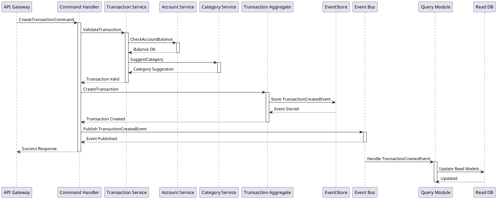
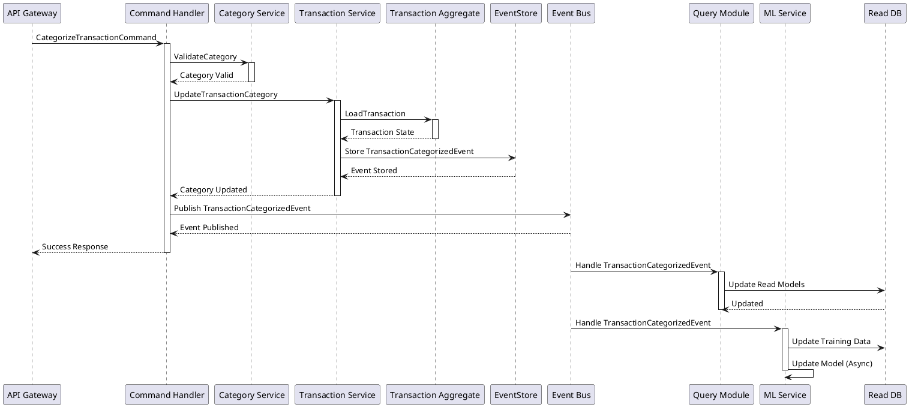
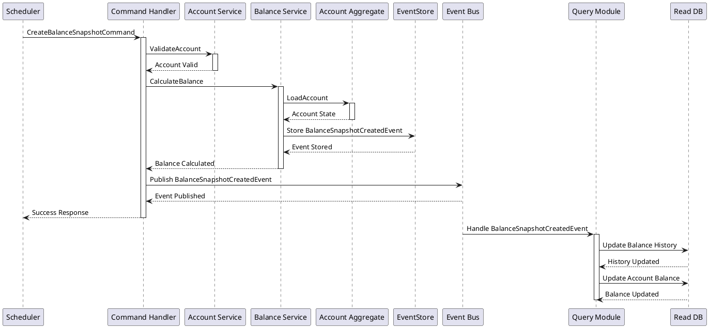
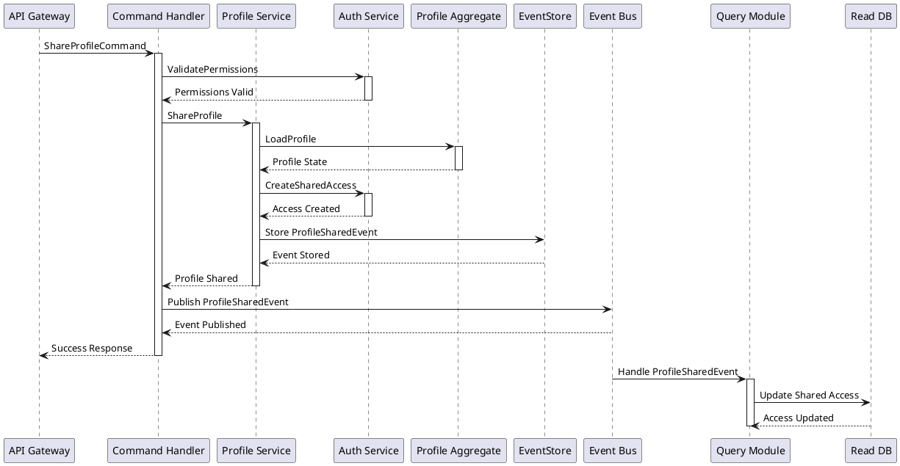
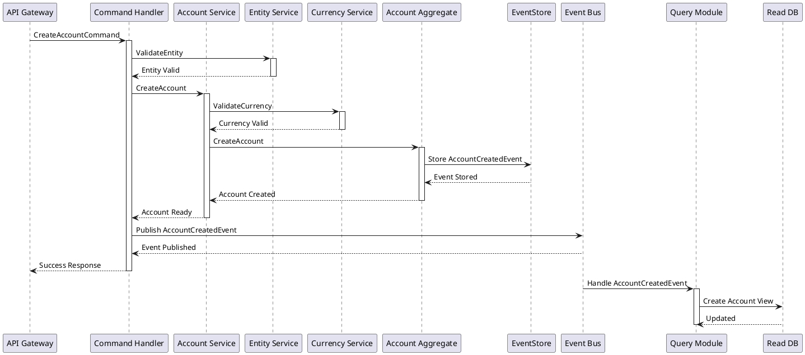
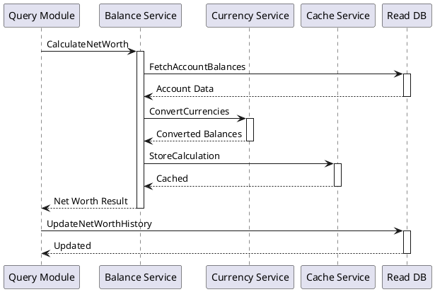
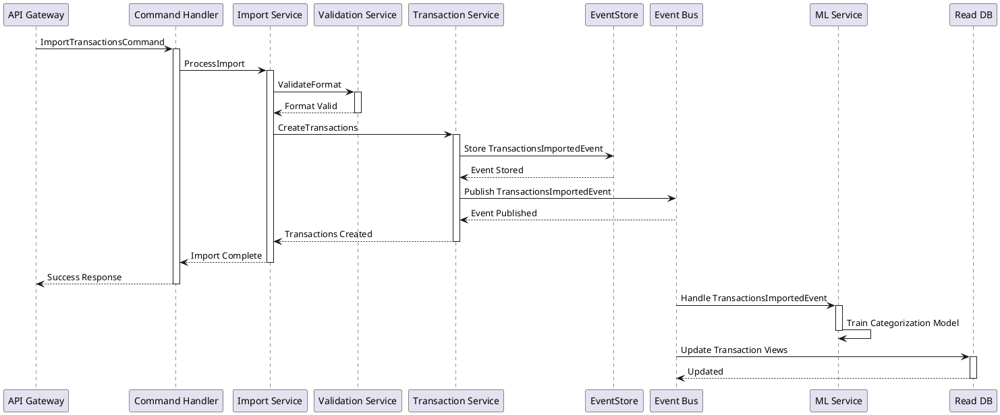
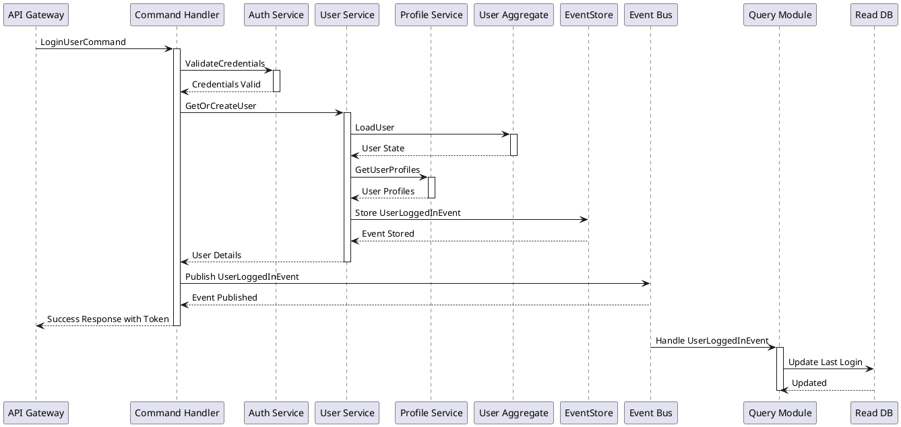
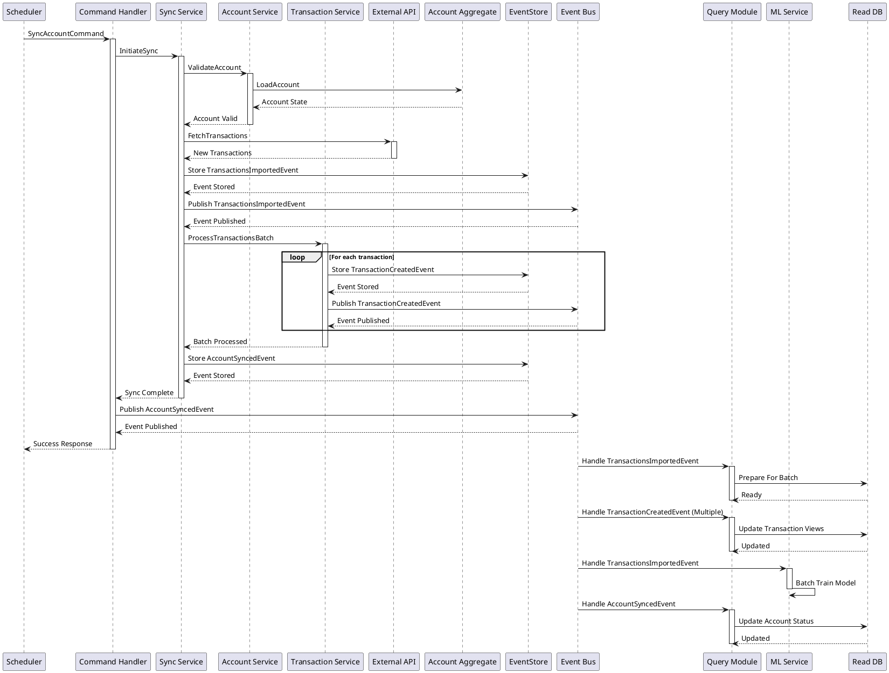

# Sequence Diagrams

## Table of Contents
- [Transaction Flows](#transaction-flows)
  - [Transaction Creation](#transaction-creation)
  - [Category Update](#category-update)
  - [Balance Snapshot](#balance-snapshot)
  - [Profile Sharing Flow](#profile-sharing-flow)
  - [Account Creation Flow](#account-creation-flow)
  - [Net Worth Calculation Flow](#net-worth-calculation-flow)
  - [Manual Transaction Import Flow](#manual-transaction-import-flow)
- [Authentication Flows](#authentication-flows)
  - [Authentication Flow](#authentication-flow)
- [Sync Flows](#sync-flows)
  - [Data Sync Flow](#data-sync-flow)

## Transaction Flows

### Transaction Creation
Shows how a new transaction flows through the system, from API request to read model update.

### Category Update
Shows the flow of updating a transaction's category, including ML model update.

### Balance Snapshot
Shows the periodic balance snapshot process and read model updates.

### Profile Sharing Flow

### Account Creation Flow

### Net Worth Calculation Flow

### Manual Transaction Import Flow

## Authentication Flows

### Authentication Flow

## Sync Flows

### Data Sync Flow

