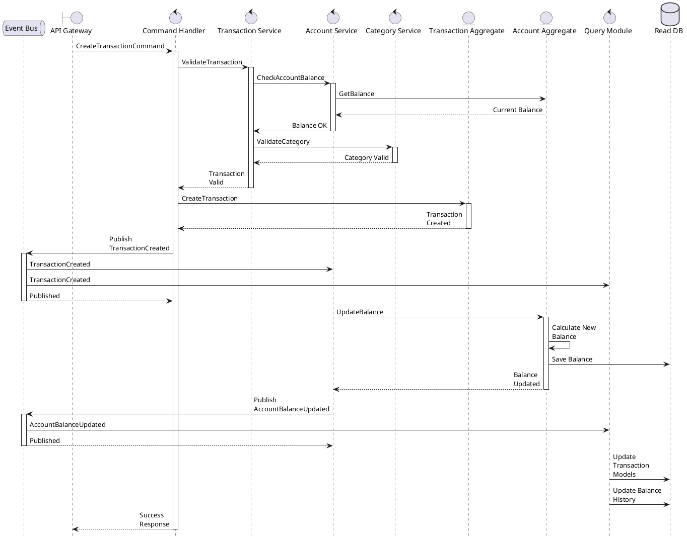
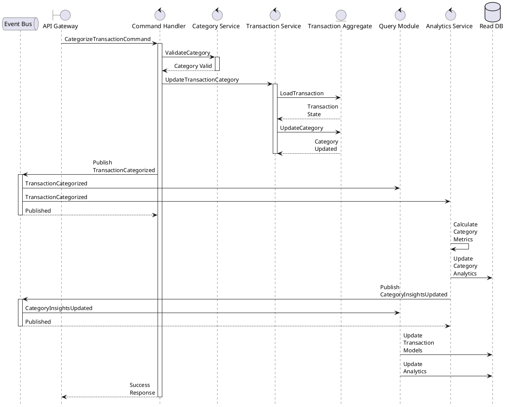
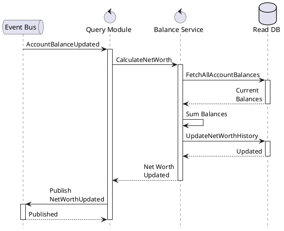
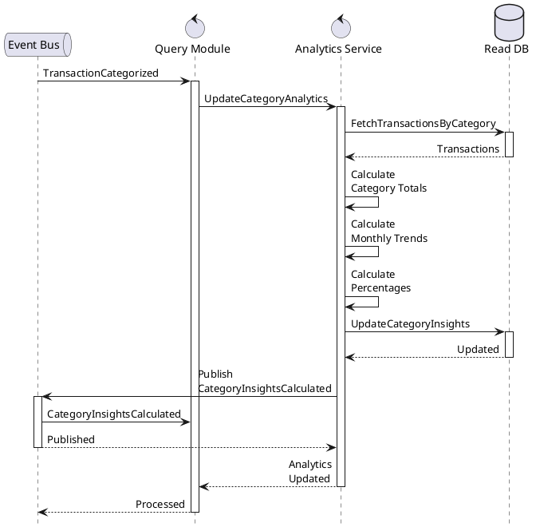

# Sequence Diagrams

## Table of Contents
- [Transaction Management](#transaction-management)
- [Balance Updates](#balance-updates)
- [Analytics Updates](#analytics-updates)

## Transaction Management

### Create Transaction

### Update Transaction Category

### Calculate Net Worth

### Calculate Category Insights

### Key Events Flow
1. Transaction Events:
   - TransactionCreated -> Updates balances, transaction models
   - TransactionCategorized -> Updates analytics, insights
   - TransactionDeleted -> Updates balances, analytics

2. Account Events:
   - AccountBalanceUpdated -> Updates net worth, balance history

3. Analytics Events:
   - CategoryInsightsUpdated -> Updates read models
   - NetWorthUpdated -> Updates dashboards
