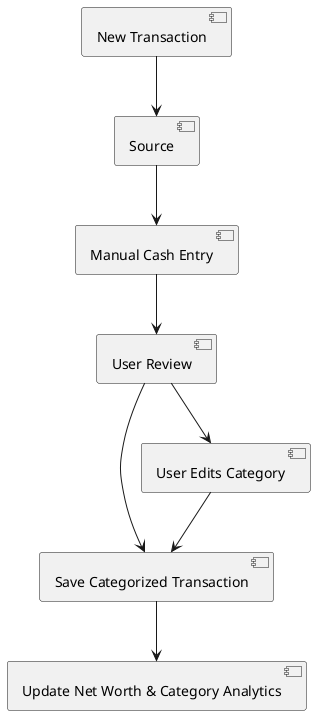
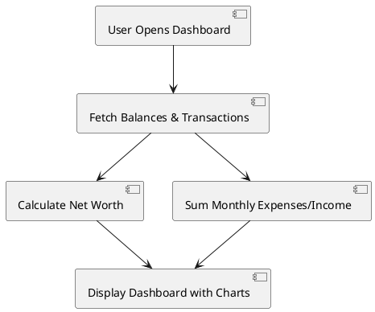
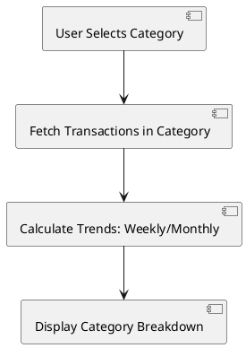

# Product Requirements Document

## **Software Description**

### **Overview**  
**Welz** is an AI-driven personal finance platform that unifies **digital and physical financial ecosystems** for individuals and households. By aggregating data from banks, investment platforms, and manual cash transactions, Welz provides a real-time, holistic view of net worth, spending habits, and financial health.  

### **Mission**  
Empower users to master their finances by bridging the gap between digital accounts and physical cash, delivering AI-curated insights, and enabling collaborative financial planning.  

---

## **Added Value**

### **Core Value Proposition**  
* **Comprehensive Financial Picture**  
   - **Unified Aggregation**: Seamlessly integrates bank accounts, credit cards, investments, **cash accounts**, and debts into a single dashboard.
   - **Physical + Digital**: Track cash transactions alongside digital spending for a complete financial snapshot.

* **Intelligent Automation**  
   - **AI-Driven Insights**: Automatically categorizes transactions, forecasts trends, and flags anomalies.
   - **Net Worth Dynamics**: Real-time calculation of assets vs. liabilities.

* **Regulatory Compliance**  
   - GDPR-compliant architecture with end-to-end encryption.

---

## **Competitive Advantages**

### **Competitor Comparison**  

| **Feature**               | **Welz**                                    | **Fintonic**               | **Monefy**                  | **Bilance**                 |  
|---------------------------|---------------------------------------------|----------------------------|-----------------------------|-----------------------------|  
| **Institution Coverage**  | 2,000+ (EU-focused, including stock market) | 1,000+ (EU-focused)        | Manual entry only           | 500+ (regional banks)       |  
| **Cash Account Support**  | ✔️ Manual logging or receipt OCR scanning   | ❌                         | ✔️ Basic manual logging     | ❌                         |  
| **AI Insights**           | Predictive analytics + anomaly detection    | Rule-based categorization  | ❌                          | Basic tagging               |  
| **Collaboration**         | Shared budgets & multi-user financials      | Individual-only            | Individual-only             | Individual-only             |  
| **Compliance**            | GDPR, PSD2, Open Banking                    | GDPR-only                  | Minimal                     | GDPR-only                   |  

---

### **Key Differentiators**  
* **Hybrid Account Management**  
   - **Unique Support for Cash**: Log physical transactions with basic details.

* **Proactive Financial Guardrails**  
   - Manual budget tracking and basic category analysis.

* **Household-Centric Design**  
   - Basic personal finance tracking.

* **Open Ecosystem**  
   - Standard data export capabilities.

---

## **Lean Canvas**  

| **Section**            | **Details**                                                                 |
|------------------------|-----------------------------------------------------------------------------|
| **Problem**            | 1. Fragmented financial data across banks, stock brokers, and cash. 2. Lack of unified net worth tracking for EU users with multi-institution portfolios. 3. Manual transaction categorization and limited insights for stock market investments. |
| **Solution**           | 1. Aggregate EU banks, stock brokers (e.g., Degiro, eToro), and cash accounts. 2. Real-time net worth dashboard with stock holdings valuation. 3. AI-driven categorization and trend analysis for stocks/transactions. |
| **Key Metrics**        | - Number of connected institutions per user. - % of users adopting AI suggestions. - Average net worth accuracy improvement. |
| **Unique Value Proposition** | *“The only platform that unifies banking, stock trading, and cash management with AI-powered financial intelligence.”* |
| **Unfair Advantage**   | 1. Hybrid aggregation (Open Banking + stock APIs + cash tracking). 2. Proprietary AI trained on EU-specific financial behavior. 3. GDPR/PSD2 compliance by design. |
| **Customer Segments**  | **Primary**: EU individuals with diversified portfolios (stocks, savings, cash). **Secondary**: Households/families managing shared expenses and long-term goals. |
| **Channels**           | 1. Web/App Store/Play Store. 2. Partnerships with EU fintechs/stock brokers. 3. Finance-focused social media (YouTube, LinkedIn). |
| **Cost Structure**     | - TrueLayer API subscription - Deno Deploy infrastructure - AI/ML model training - Compliance/audit costs. |
| **Revenue Streams**    | - **Freemium**: Free tier (basic features). - **Subscription**: Premium tier (advanced analytics, shared budgets). |

---

## **Use Cases**  

### **Use Case 1: Categorize New Transactions**  

**Description**:  
Automatically categorizes new transactions from **manual cash entries** or **synced financial accounts** using AI suggestions, allowing users to refine labels.  

**Flow**:  
1. **Transaction Source**:  
   - **Manual Cash Entry**: User inputs amount, date, and notes.  
   - **Synced Account**: Aggregator imports transactions from connected accounts.  
2. **AI Suggestion**: AI model suggests a category (e.g., "Groceries" for a transaction at "Lidl").  
3. **User Review**:  
   - **Accept**: Transaction is saved with the AI-suggested category.  
   - **Reject**: User edits the category (e.g., changes "Entertainment" to "Dining").  
4. **Data Update**:  
   - Categorized transactions update the net worth dashboard and category analytics.  

**Diagram**:  

---

### **Use Case 2: View Financial Insights Dashboard**  

**Description**:  
Displays real-time net worth and monthly income/expenses.

**Flow**:  
1. **Fetch Data**:  
   - Aggregates balances from connected accounts (bank, stocks, cash).  
   - Fetches transactions for the current month.  
2. **Calculate Metrics**:  
   - **Net Worth**: Assets (cash + stocks + bank) – Liabilities (loans + credit).  
   - **Current Month Expenses/Income**: Sum of categorized transactions.  
   - **Portfolio Change**: % change in stock holdings.  
   - **EOM Prediction**: Projects net worth based on current spending/income trends.  
3. **Display Dashboard**:  
   - Visualizes trends (line/pie charts).  
   - Highlights overspending alerts or portfolio risks.  

**Diagram**:  

---

### **Use Case 3: Analyze Per-Category Expenses & Income**  

**Description**:  
Drill down into specific categories (e.g., "Groceries", "Salary") to analyze spending patterns and income sources.  

**Flow**:  
1. **Select Category**: User chooses a category from the dashboard.  
2. **Fetch Transactions**: Retrieves all transactions in the selected category.  
3. **Display Analytics**:  
   - **Trends**: Weekly/monthly spending/income.  

**Diagram**:  

